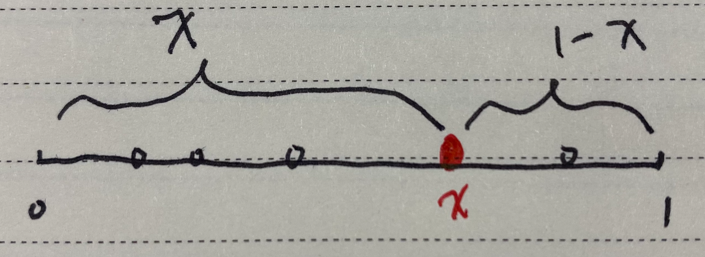
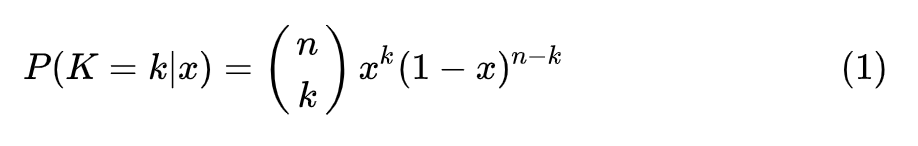
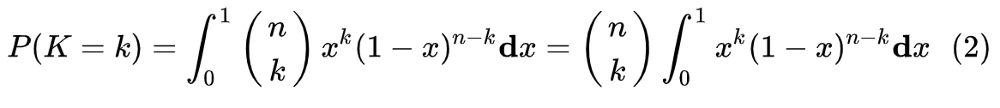
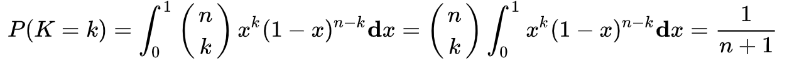
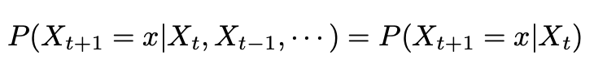
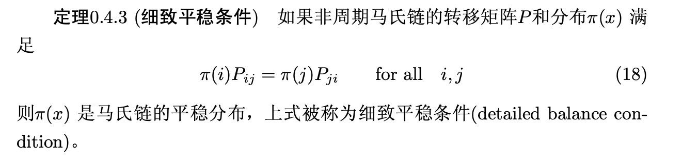
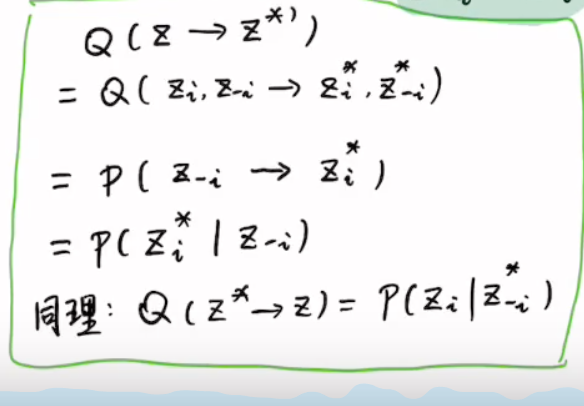
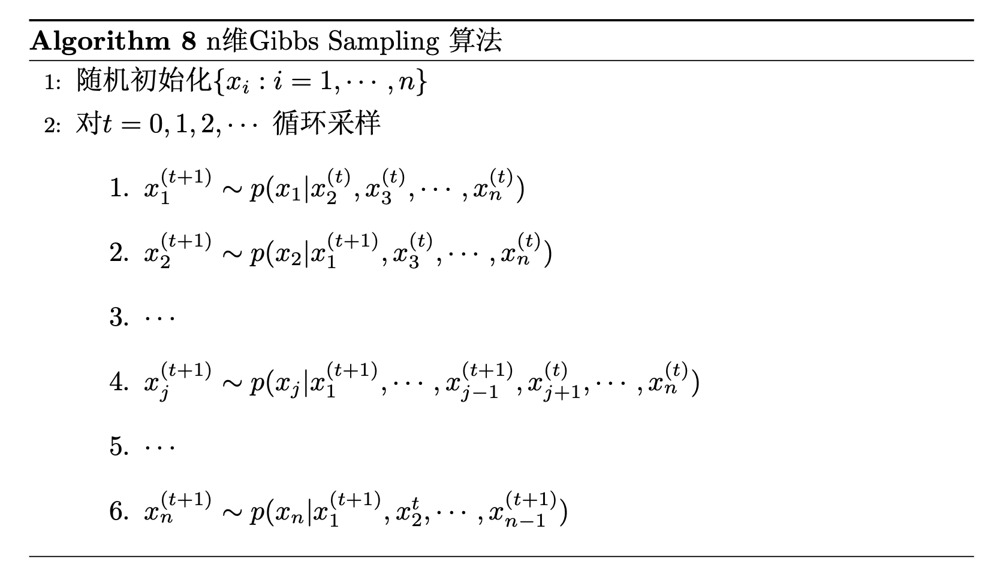

# 0LDA原理及实践

[TOC]

## 简介

https://segmentfault.com/a/1190000022042563

https://blog.csdn.net/aws3217150/article/details/53840029

## 预备知识：

先做一下前期的推导：

假设向长度为1的桌子上扔一个红球（如上图），它会落在0到1这个范围内，设这个长度值为x，再向桌上扔一个白球，那么这个白球落在红球左边的概率即为x。 若一共扔了n次白球，其中每一次都是相互独立的，假设落在红球左边的白球数量为k，那么随机变量K服从参数为 ![[公式]](https://www.zhihu.com/equation?tex=n) 和 ![[公式]](https://www.zhihu.com/equation?tex=x) 的二项分布B(n,k)，有

X服从 [0, 1] 上的均匀分布，

K对每一个 ![[公式]](https://www.zhihu.com/equation?tex=x) 都有上面的分布，对于所有可能的 ![[公式]](https://www.zhihu.com/equation?tex=x) ， ![[公式]](https://www.zhihu.com/equation?tex=K) 的分布为

现在，我们换一种方式来丢球：

> 先将这n+1个球都丢出来，再选择一个球作为红球，任何一个球被选中的概率均为$\frac{1}{n+1}$，此时红球左边有0,1,2,...,n个球的概率均为$\frac{1}{n+1}$ ，有
>
> 
> 则
>
> 

### Gamma函数

定义：
$$
\Gamma(x)=\int_0^\infty t^{x-1}e^{-t}dt\,.
$$
递归性质：
$$
\Gamma(x+1)=x\Gamma(x)
$$
可以证明，Gamma函数是阶乘在实数集上的延拓：
$$
\Gamma(n)=(n-1)!
$$

### Gamma分布

对Gamma函数做一个变形：
$$
\int_0^\infty \frac{x^{\alpha-1}e^{-x}}{\Gamma(\alpha)}dx = 1\,.
$$
取积分中的函数作为概率密度，就可以得到一个最为简单的Gamma分布：
$$
Gamma(x|\alpha)= \frac{x^{\alpha-1}e^{-x}}{\Gamma(\alpha)}
$$

### Beta函数

考虑一下这个积分：

稍作变换，令$k = \alpha-1, n-k=\beta-1$,有：
$$
\int_0^1 x^{\alpha-1}(1-x)^{\beta-1}dx=\frac{(\alpha-1)!(\beta-1)!}{(\alpha+\beta-1)!}=\frac{\Gamma(\alpha)\Gamma(\beta)}{\Gamma(\alpha+\beta)}.
$$
即，Beta函数：$\Beta(\alpha, \beta)=\frac{\Gamma(\alpha)\Gamma(\beta)}{\Gamma(\alpha+\beta)}.$

### Beta分布

对Beta函数做一个变形：
$$
\int_0^1 \frac{x^{\alpha-1}(1-x)^{\beta-1}}{\Beta(\alpha, \beta)}dx=1
$$
取积分中的函数作为概率密度，就可以得到一个最为简单的Beta分布：
$$
Beta(x|\alpha, \Beta)= \frac{x^{\alpha-1}(1-x)^{\beta-1}}{\Beta(\alpha, \beta)}=x^{\alpha-1}(1-x)^{\beta-1} \cdot \frac{\Gamma(\alpha+\beta)}{\Gamma(\alpha)\Gamma(\beta)}=x^{\alpha-1}(1-x)^{\beta-1} \cdot \frac{(\alpha+\beta-1)!}{(\alpha-1)!(\beta-1)!}
$$

### Dirichlet分布

Dirichlet分布是将Beta分布扩展到高维的情形，一般形式的Dirichlet分布定义如下：

### MCMC采样（Markov Chain Monte Carlo）

#### 数学背景

* **常见的采样方法：**
  * 概率分布采样
  * 拒绝采样
  * 重要性采样
  * MCMC
  * Gibbs采样

* **马氏链**：时间与状态都是离散的，当前时刻的状态只与上一个时刻的状态有关。

  

* **平稳分布：**

  

  摘自《LDA数学八卦》

* **细致平稳分布：**

  

* **细致平稳分布是平稳分布的充分非必要条件**

#### 采样原理

假设有一转移矩阵为$Q$，马氏链$q(i,j)$表示从状态i转移到状态j的概率，等价于$q(j|i)$或$q(i\rightarrow j)$，显然，通常情况下：
$$
p(i)q(i,j)\neq p(j)q(j,i)
$$
也就是细致平稳条件不成立，现在想要通过对马氏链做一个构造，使得细致平稳条件成立，可以引入一个接受率$\alpha(x,j)$，使得
$$
p(i)q(i,j)\alpha(i,j) = p(j)q(j,i)\alpha(j,i)
$$
按照对称性，令

使得

成立。

MCMC采样算法过程：

进一步，如果接受率过小，采样过程中马氏链容易原地踏步，拒绝大量的跳转，使得马氏链遍历所有的状态空间花费时间较长，收敛到平稳分布的速度太慢，如果对接受率进行微小改造，取
$$
\alpha(i,j)=\min\{1, \frac{p(j)q(j,i)}{p(i)q(i,j)}\}, \ \  \alpha(j,i)=\min\{1, \frac{p(i)q(i,j)}{p(j)q(j,i)}\}
$$
推导：
$$
\begin{align}
p(i)q(i,j)\alpha(i,j) &= p(i)q(i,j)\min\{1, \frac{p(j)q(j,i)}{p(i)q(i,j)}\} \\
	&=\min\{p(i)q(i,j),p(j)q(j,i) \} \\
	&=p(j)q(j,i)\min\{\frac{p(i)q(i,j)}{p(j)q(j,i)}, 1 \} \\
	&=p(i)q(j,i)\alpha(j,i)
\end{align}
$$
就得到了教科书中常见的Metropolis-Hastings算法。

### Gibbs采样（吉布斯采样）

推广到高维情形，由于接受率$\alpha$<1，Metropolis-Hastings算法的效率不够高，因此希望能够找到一个转移矩阵，使得接受率$\alpha$恒等于1.

因此，数学家也就发展出了一种Metropolis-Hastings算法的特例，即Gibbs采样算法。

Gibbs算法的特殊之处在于：

* 采用条件概率取代转移矩阵Q
  $$
  \sum_{j=1}^{\infty} p(i\rightarrow j)=1
  $$

* 每次采样时固定其它维度，只在某一维度上进行采样操作

  例如，考虑如下三维情形，

  

* 接受率恒等于1

  

* 算法流程：

  

**Gibbs采样参考代码：[basic_gibbs_sampling_via_mlm.py](https://github.com/bojone/bert4keras/blob/master/examples/basic_gibbs_sampling_via_mlm.py)**

## 原理

## 实践

https://github.com/baidu/Familia

https://github.com/KimMeen/Weibo-Analyst