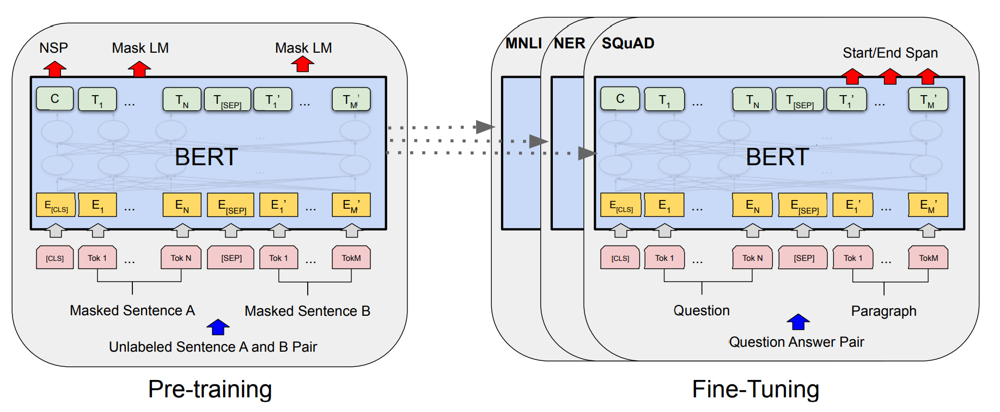

# 预训练模型BERT总结

## 提出（propose）

* **预训练**：基本思想是模型在A任务上进行训练，然后迁移到B任务上继续学习，这里的A任务指的是通用的basic任务，B任务指的是特定领域或design的任务。在图像领域，比较著名的模型是ResNet，首先在ImageNet大数据集上进行预训练，使得模型能够具有基础特征提取的能力，然后再图像分类/识别等特定场景下进行微调；在NLP领域中的预训练思想也是如此。

* **词向量的分类**：

  * 静态词向量（fixed/static）：word2vec/glove/one-hot
  * 动态词向量（adjusted/contextualized）：elmo/gpt/bert

* **ELMO(Embeddings from Language Model)**：

  * [Deep contextualized word representations.pdf](file:///Users/mac/Library/Mobile Documents/iCloud~QReader~MarginStudy/Documents/论文/预训练语言模型/Deep contextualized word representations.pdf)

  * 预训练语言模型：利用两个独立的单向语言模型实现双向语言模型

    

  * Deep contextualized word representations

* **GPT**:

  

  

  

## 模型（structure）

## 预训练（pre-training）

两个训练任务：

* Masking Language Model(MLM)

  

* Next Sentence Prediction(NSP)

  

## 微调（fine-tuning）

## 源码学习（code）

## 改进（improvement）

* 数据增强
* RoBerta
* ERINE: Enhanced Representation through Knowledge Integration, Baidu
* ALBert
* 

## 比较

- BERT and GPT are transformer-based architecture while ELMo is Bi-LSTM Language model.
- BERT is purely **Bi-directional**, GPT is **unidirectional** and ELMo is semi-bidirectional.
- GPT is trained on the **BooksCorpus (800M words)**; BERT is trained on the **BooksCorpus (800M words)** and **Wikipedia (2,500M words)**.
- GPT uses a sentence separator ([SEP]) and classifier token ([CLS]) which are only introduced at fine-tuning time; BERT learns [SEP], [CLS] and sentence A/B embeddings during pre-training.
- GPT was trained for 1M steps with a batch size of 32,000 words; BERT was trained for 1M steps with a batch size of 128,000 words.
- GPT used the same learning rate of 5e-5 for all fine-tuning experiments; BERT chooses a task-specific fine-tuning learning rate which performs the best on the development set.
- GPT是一个生成式模型；

## 总结

[glossary](https://huggingface.co/transformers/glossary.html)

[The Illustrated BERT, ELMo, and co. (How NLP Cracked Transfer Learning) – Jay Alammar – Visualizing machine learning one concept at a time. (jalammar.github.io)](https://jalammar.github.io/illustrated-bert/)

[BERT- Pre-training of Deep Bidirectional Transformers for Language Understanding.pdf](file:///Users/mac/Library/Mobile Documents/iCloud~QReader~MarginStudy/Documents/论文/预训练语言模型/BERT- Pre-training of Deep Bidirectional Transformers for Language Understanding.pdf)

[Generalized Language Models (lilianweng.github.io)](https://lilianweng.github.io/lil-log/2019/01/31/generalized-language-models.html)

