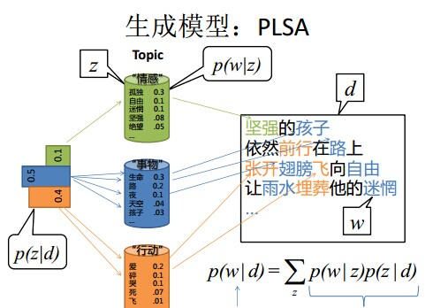
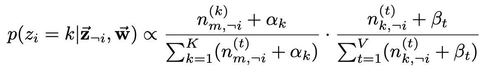

# LDA原理及实践

[TOC]

## 简介

## 预备知识：

先做一下前期的推导：

假设向长度为1的桌子上扔一个红球（如上图），它会落在0到1这个范围内，设这个长度值为x，再向桌上扔一个白球，那么这个白球落在红球左边的概率即为x。 若一共扔了n次白球，其中每一次都是相互独立的，假设落在红球左边的白球数量为k，那么随机变量K服从参数为 ![[公式]](https://www.zhihu.com/equation?tex=n) 和 ![[公式]](https://www.zhihu.com/equation?tex=x) 的二项分布B(n,k)，有

X服从 [0, 1] 上的均匀分布，

K对每一个 ![[公式]](https://www.zhihu.com/equation?tex=x) 都有上面的分布，对于所有可能的 ![[公式]](https://www.zhihu.com/equation?tex=x) ， ![[公式]](https://www.zhihu.com/equation?tex=K) 的分布为

现在，我们换一种方式来丢球：

> 先将这n+1个球都丢出来，再选择一个球作为红球，任何一个球被选中的概率均为$\frac{1}{n+1}$，此时红球左边有0,1,2,...,n个球的概率均为$\frac{1}{n+1}$ ，有
>
> 
> 则
>
> 

### Gamma函数

定义：
$$
\Gamma(x)=\int_0^\infty t^{x-1}e^{-t}dt\,.
$$
递归性质：
$$
\Gamma(x+1)=x\Gamma(x)
$$
可以证明，Gamma函数是阶乘在实数集上的延拓：
$$
\Gamma(n)=(n-1)!
$$

### Gamma分布

对Gamma函数做一个变形：
$$
\int_0^\infty \frac{x^{\alpha-1}e^{-x}}{\Gamma(\alpha)}dx = 1\,.
$$
取积分中的函数作为概率密度，就可以得到一个最为简单的Gamma分布：
$$
Gamma(x|\alpha)= \frac{x^{\alpha-1}e^{-x}}{\Gamma(\alpha)}
$$

### Beta函数

考虑一下这个积分：

稍作变换，令$k = \alpha-1, n-k=\beta-1$,有：
$$
\int_0^1 x^{\alpha-1}(1-x)^{\beta-1}dx=\frac{(\alpha-1)!(\beta-1)!}{(\alpha+\beta-1)!}=\frac{\Gamma(\alpha)\Gamma(\beta)}{\Gamma(\alpha+\beta)}.
$$
即，Beta函数：$\Beta(\alpha, \beta)=\frac{\Gamma(\alpha)\Gamma(\beta)}{\Gamma(\alpha+\beta)}.$

### Beta分布

对Beta函数做一个变形：
$$
\int_0^1 \frac{x^{\alpha-1}(1-x)^{\beta-1}}{\Beta(\alpha, \beta)}dx=1
$$
取积分中的函数作为概率密度，就可以得到一个最为简单的Beta分布：
$$
Beta(x|\alpha, \Beta)= \frac{x^{\alpha-1}(1-x)^{\beta-1}}{\Beta(\alpha, \beta)}=x^{\alpha-1}(1-x)^{\beta-1} \cdot \frac{\Gamma(\alpha+\beta)}{\Gamma(\alpha)\Gamma(\beta)}=x^{\alpha-1}(1-x)^{\beta-1} \cdot \frac{(\alpha+\beta-1)!}{(\alpha-1)!(\beta-1)!}
$$

### Dirichlet分布

Dirichlet分布是将Beta分布扩展到高维的情形，一般形式的Dirichlet分布定义如下：

### MCMC采样（Markov Chain Monte Carlo）

#### 数学背景

* **常见的采样方法：**
  * 概率分布采样
  * 拒绝采样
  * 重要性采样
  * MCMC
  * Gibbs采样

* **马氏链**：时间与状态都是离散的，当前时刻的状态只与上一个时刻的状态有关。

  

* **平稳分布：**

  

  摘自《LDA数学八卦》

* **细致平稳分布：**

  

* **细致平稳分布是平稳分布的充分非必要条件**

#### 采样原理

假设有一转移矩阵为$Q$，马氏链$q(i,j)$表示从状态i转移到状态j的概率，等价于$q(j|i)$或$q(i\rightarrow j)$，显然，通常情况下：
$$
p(i)q(i,j)\neq p(j)q(j,i)
$$
也就是细致平稳条件不成立，现在想要通过对马氏链做一个构造，使得细致平稳条件成立，可以引入一个接受率$\alpha(x,j)$，使得
$$
p(i)q(i,j)\alpha(i,j) = p(j)q(j,i)\alpha(j,i)
$$
按照对称性，令

使得

成立。

MCMC采样算法过程：

进一步，如果接受率过小，采样过程中马氏链容易原地踏步，拒绝大量的跳转，使得马氏链遍历所有的状态空间花费时间较长，收敛到平稳分布的速度太慢，如果对接受率进行微小改造，取
$$
\alpha(i,j)=\min\{1, \frac{p(j)q(j,i)}{p(i)q(i,j)}\}, \ \  \alpha(j,i)=\min\{1, \frac{p(i)q(i,j)}{p(j)q(j,i)}\}
$$
推导：
$$
\begin{align}
p(i)q(i,j)\alpha(i,j) &= p(i)q(i,j)\min\{1, \frac{p(j)q(j,i)}{p(i)q(i,j)}\} \\
	&=\min\{p(i)q(i,j),p(j)q(j,i) \} \\
	&=p(j)q(j,i)\min\{\frac{p(i)q(i,j)}{p(j)q(j,i)}, 1 \} \\
	&=p(i)q(j,i)\alpha(j,i)
\end{align}
$$
就得到了教科书中常见的Metropolis-Hastings算法。

### Gibbs采样（吉布斯采样）

推广到高维情形，由于接受率$\alpha$<1，Metropolis-Hastings算法的效率不够高，因此希望能够找到一个转移矩阵，使得接受率$\alpha$恒等于1.

因此，数学家也就发展出了一种Metropolis-Hastings算法的特例，即Gibbs采样算法。

Gibbs算法的特殊之处在于：

* 采用条件概率取代转移矩阵Q
  $$
  \sum_{j=1}^{\infty} p(i\rightarrow j)=1
  $$

* 每次采样时固定其它维度，只在某一维度上进行采样操作

  例如，考虑如下三维情形，

  

* 接受率恒等于1

  

* 算法流程：

  

**Gibbs采样参考代码：[basic_gibbs_sampling_via_mlm.py](https://github.com/bojone/bert4keras/blob/master/examples/basic_gibbs_sampling_via_mlm.py)**

## 文本建模

日常生活中，总是产生大量的文本，如果每一篇文本存储为一篇文档，那每篇文档可以看作是一个有序的词的序列$d=(w_1, w_2,w_3,...,w_n)$

统计建模的目的就是学习语料库中的词序列时如何生成的模式。根据观察的角度不同，统计文本建模分为了两个流派：

* 频率派
* 贝叶斯派

1. **频率派**

假设语料库一共有V个词，$(v_1, v_2, v_3, ...v_V)$，最简单的unigram model如下：

类似于抛硬币的贝努利实验，只不过这里的骰子是V面的，各个面的概率记为$\vec{p}=(p_1,p_2,...,p_v)$，抛这个V面的骰子的过程服从多项式分布，记为$w \sim Mult(w|\vec{p}) $。

对于一篇文档$d=\vec{w}=(w_1, w_2,w_3,...,w_n)$，该文档被生成的概率为

而文档和文档之间可以看作是独立的，假如语料库有多篇文档$W=(\vec{w_1}, \vec{w_2},...,\vec{w_m})$，则该语料的概率是

unigram model使用的是bag of word，即假设文档之间是独立可交换的，文档中的词也是独立可交换的，假设语料中的总的词频是N，对于每一个词的发生次数$n_i$, $\vec{n}=(n_1, n_2, ...,n_v)$是一个多项式分布

语料库的概率：

接下来的任务就是估计模型的参数$\vec{p}$，使用极大似然估计，参数$p_i$的估计值就是

2. **贝叶斯派**

在贝叶斯统计学家的角度看来，一切变量都是随机变量，也就是说上帝的骰子$\vec{p}$也是随机的，

上帝的骰子$\vec{p}$服从一个先验分布$p(\vec{p})$，从这个角度来说，语料库的概率：
$$
p(W)=\int p(W|\vec{p})p(\vec{p})d\vec{p}
$$
注意到先前所说的每一个词的发生次数$n_i$, $\vec{n}=(n_1, n_2, ...,n_v)$是一个多项式分布，因此可以选择多项式的共轭分布——Drichlet分布作为骰子$\vec{p}$的先验分布，

每次按照先验分布$p(\vec{p})$的概率选择一个骰子，然后进行多项式分布产生word

$\Delta(\vec{\alpha})$是归一化因子$Dir(\vec{\alpha})$，即

有了先验分布，可以直接推出后验分布

在贝叶斯框架下，估计参数$\vec{p}$可以选用后验分布的极大值点，或者是参数在后验分布下的平均值，于是对每一个$p_i$，

进一步，计算文本语料的生成概率：

## 主题模型

假设我们在进行写作，我们首先要从许多主题中选择一个，然后根据这个主题，从大脑中搜索所有与该主题有关的词汇，这一过程带着大量的主观色彩，而计算机不同，只能通过先验分布进行采样。也就是说，只要确定好了两个关键的分布（文章与主题分布，主题与词汇分布），计算机就能够按照一定的规律生成一篇文章。

假设一篇文章是这样生成的：

（1）为文章定义一个基调，即主题分布，比如“科技”主题出现概率为75%，“金融”主题出现概率为20%，“地产”主题出现概率为5%；

（2）为每个主题定义一个基调，即词语的分布，比如“科技”主题中，10%的概率出现“特斯拉”，10%的概率出现“3D打印”....，而“金融”主题中，仅1%的概率出现“特斯拉”，2%的概率出现“3D”打印...；

（3）遍历文章的每一个位置，假设它的词是这样产生的，从主题分布中随机选择一个主题，然后从该主题中随机选择一个词出来，重复该过程，直到文章结束。

根据频率派和贝叶斯派两大观点，主题模型也包括了两种：PLSA模型和LDA主题模型。

简要介绍一下PLSA主题模型的大致原理，生成一篇文章，首先确定好主题分布$p(z|d)$和词汇分布$p(w|z)$，如图，假设主题分布为{"情感"：0.1，“事物”：0.5，“行动”：0.4}，按照概率选取某一主题，在该主题下，按照概率产生相应的单词。由于主题分布和词汇分布服从多项式分布，因此可以很方便地利用极大似然估计来求解概率分布的参数。

本文所介绍的LDA(Latent Dirichlet Allocation)主题模型是属于贝叶斯流派的一种，实际上就是在PLSA主题模型的基础上加了两个Dirichlet分布。在贝叶斯的观点下，一切未知参数都是随机变量，不能认为是某一个固定的值。因此，在文档生成的过程中，主题分布和词汇分布都是未知的，但是均服从Dirichlet先验分布。比如{P(zi), i =1,2,3 }等于{0.4,0.5,0.1}或{0.2,0.2,0.6} ， 是由dirichlet先验给定的，不是根据文档产生的。所以，LDA生成文档的过程中，先从dirichlet先验中“随机”抽取出主题分布，然后从主题分布中“随机”抽取出主题，最后从确定后的主题对应的词分布中“随机”抽取出词。

LDA主题模型：

### 物理过程

使用概率图模型表示，LDA主题模型的游戏过程如图所示

这个概率图可以分解成两个物理过程，对应文本生成的两个过程：

1. $\vec{\alpha} \rightarrow \vec{\theta_m} \rightarrow z_{m,n}$表示在生成第m篇文章的时候，先从第一个坛子中抽了一个doc-topic骰子$\vec{\theta_m}$，然后投掷这个骰子生成了文章中第n个词的topic编号$z_{m,n}$，满足$z_{m,n} \sim \vec{\theta_m}$
2. $\vec{\beta}\rightarrow \vec{\varphi_k} \rightarrow w_{m,n}|k=z_{m,n}$，这个过程表示生成第m篇文章第n个词：在K个topic-word骰子$c$中，挑选编号为$k=z_{m,n}$的那个骰子进行投掷，然后生成word$w_{m,n}$，满足$w_{m,n} \sim \vec{\varphi_k}$

$\vec{\alpha}, \vec{\beta}$都是Drichlet分布作为先验分布。

有了以上参数的定义后，可以写出第m篇文章生成的联合概率分布：

第一个过程，整体是一个Dirichlet-Multinomial共轭结构：

有
$$
\begin{align}
p(\vec{z_m}|\vec{\alpha}) &= \int p(\vec{z_m} | \vec{\theta_m})p(\vec{\theta_m}|\vec{\alpha})d(\vec{p}) \\
 &= \int p(\vec{z_m} | \vec{\theta_m})Dir(\vec{\theta_m}|\vec{\alpha})d(\vec{p}) \\
 &= \int \prod_{i=1}^K p_{i}^{n_m^i} \frac{1}{\Delta(\vec{\alpha})} \cdot \prod_{i=1}^Kp_i^{\alpha_i-1}d(\vec{p}) \\
 &= \frac{1}{\Delta(\vec{\alpha})} \int \prod_{i=1}^Kp_i^{{n_m^i} + \alpha_i-1}d(\vec{p}) \\
 &= \frac{\Delta(\vec{n_m}+\vec{\alpha})}{\Delta(\vec{\alpha})}
\end{align}
$$

其中，$\vec{n_m}=(n_m^{(1)}, n_m^{(2)}, ..., n_m^{(K)})$表示第m篇文章中第k个topic出现的次数（产生的词的个数）。

由于语料库中M篇文档的topics生成过程相互独立，所以我们得到M个相互独立的Dirichlet-Multinomial共轭结构，从而可以得到整个语料库中topics的生成概率：

生成完语料中所有词的topic，然后对每个词在给定topic的条件下生成word。

在第二个物理过程中，在$k=z_{m,n}$条件的限制下，语料中任意两个由topic k生成的词都是可交换的，因此可以不再考虑文档的概率，转而考虑由同一个topic生成的词。同样的，第二个物理过程也对应着一个Dirichlet-Multinomial共轭结构：

同理可以得到：
$$
\begin{align}
p(\vec{w_k}|\vec{\beta}) &= \frac{\Delta(\vec{n_k}+\vec{\beta})}{\Delta(\vec{\beta})}
\end{align}
$$
其中，$\vec{n_k}=(n_k^{(1)}, n_k^{(2)}, ..., n_k^{(t)},..., n_k^{(V)})$表示第k个topic下产生的word t的个数。

进一步可以得到整个语料中词生成的概率：

结合两个物理过程，最终得到整个语料库的生成概率：

### Gibbs sampling

直接从联合分布推导概率分布的参数比较困难时，因此我们可以采用近似推断的方法对概率分布进行采样，当采样收敛之后得到样本可以反向计算概率分布的参数。LDA主题模型使用的是Gibbs采样。

首先，回顾一下LDA主题模型的概率图结构：

参数说明：

* $\alpha$：主题的先验知识
* $\beta$：词语的先验知识
* $\theta$：主题的多项式分布
* $\varphi$：词语的多项式分布
* z：某个主题
* w：主题z下的某个词语
* N：语料库的总词数
* M：语料库的文章数
* K：主题数
* 黑框：表示抽样过程重复多少次

首先，在生成第m篇文章的第n个词时，模型以$\alpha$为先验选取主题的分布$\theta$，然后按照$\theta$选取某一主题z，接着，在主题为z的条件下，按照词语的先验知识$\beta$，选择词汇的多项分布$\varphi$，然后从多项分布中抽取某一词语w，这一过程重复N次，直至生成结束。

换言之：

* 假定语料库中共有M篇文章，每篇文章下的Topic的主题分布是一个从参数为的Dirichlet先验分布中采样得到的Multinomial分布，每个Topic下的词分布是一个从参数为的Dirichlet先验分布中采样得到的Multinomial分布。
* 对于某篇文章中的第n个词，首先从该文章中出现的每个主题的Multinomial分布（主题分布）中选择或采样一个主题，然后再在这个主题对应的词的Multinomial分布（词分布）中选择或采样一个词。不断重复这个随机生成过程，直到M篇文章全部生成完成。

LDA的目标是得到主题的多项式分布和词语的多项式分布，估计未知参数$\theta$和$\varphi$可以用变分推断(Variational inference)算法，即EM算法，也可以用Gibbs采样，前者的思想是最大后验估计MAP（MAP与MLE类似，都把未知参数当作固定的值），后者的思想是贝叶斯估计。贝叶斯估计是对MAP的扩展，但它与MAP有着本质的不同，即贝叶斯估计把待估计的参数看作是服从某种先验分布的随机变量。

本文所介绍的是采用Gibbs采样法，则对于给定的先验分布，我们需要得到对应分布各个特征维度的条件概率分布（后验分布），得到期望$\hat{\theta_{mk}}$和$\hat{\varphi_{kt}}$。

**为什么要选择先验分布为Dirichlet分布呢？**

因为我们已知主题的分布和词汇的分布本身是多项式分布，而多项式分布的共轭分布是Dirichlet分布，根据多项分布的参数p选取的先验分布是Dirichlet分布，那么以p为参数的多项分布用贝叶斯估计得到的后验分布仍然是Dirichlet分布，因此选择Dirichlet 分布作为它们的共轭先验分布，主要是方便计算。

我们的所有文档联合起来形成的词向量𝑤⃗是已知的数据，不知道的是语料库主题𝑧⃗的分布。假如我们可以先求出𝑤,z的联合分布𝑝(𝑤⃗ ,𝑧⃗ )，进而可以求出某一个词$w_i$对应主题特征$z_i$的条件概率分布$𝑝(𝑧_𝑖=𝑘|𝑤⃗ ,𝑧⃗_{¬𝑖})$。其中，$𝑧⃗_{¬𝑖}$代表去掉下标为𝑖的词对应的主题后的主题分布。有了条件概率分布$𝑝(𝑧=𝑘|𝑤⃗ ,𝑧⃗_{¬𝑖})$，我们就可以进行Gibbs采样，最终在Gibbs采样收敛后得到第𝑖个词的主题。

如果我们通过采样得到了所有词的主题，那么通过统计所有词的主题计数，就可以得到各个主题的词分布。接着统计各个文档对应词的主题计数，就可以得到各个文档的主题分布。

以上就是Gibbs采样算法求解LDA的思路。

我们已经知道LDA模型的文档建模的联合分布：

有了联合分布，我们就可以求Gibbs采样需要的条件分布$p(z_i=k| \vec w,\vec z_{\neg i})$，需要注意的是这里的i是一个二维下标(m,n)，表示第m篇文章的第n个单词

对于下标i，它所对应的词$w_i$是可以观察到的，因此有：
$$
p(z_i=k| \vec w,\vec z_{\neg i}) \propto p(z_i=k, w_i =t| \vec w_{\neg i},\vec z_{\neg i})
$$
Gibbs Sampling公式推导比较复杂，这里直接借用《LDA数学八卦的结果》：

最终得到每个词对应主题的Gibbs采样的条件概率公式：

公式右边其实就是$p(topic|doc)·p(word|topic)$，这个概率其实就是doc -> topic -> word的路径概率，由于topic有K个，所以Gibbs sampling公式的物理意义就是在这K条路径中进行采样。

有了这个公式，我们就可以用Gibbs采样去采样所有词的主题，当Gibbs采样收敛后，即得到所有词的采样主题。

利用所有采样得到的词和主题的对应关系，我们就可以得到每个文档词主题的分布$\theta_m$和每个主题中所有词的分布$\varphi_k$。

### 总结

现在我们总结下LDA Gibbs采样算法流程。首先是训练流程：

通常，在LDA模型训练的过程中，取Gibbs Sampling收敛之后的n个迭代的结果进行平均来做参数估计，这样可以得到质量更高的模型。

对于新文档，公式中的$\hat{\varphi_{kt}}$部分稳定不变，只要估计文档的主题分布就可以：

## 实践

https://radimrehurek.com/gensim/models/ldamodel.html

https://github.com/baidu/Familia

https://github.com/KimMeen/Weibo-Analyst

参考链接：

https://zhuanlan.zhihu.com/p/31470216

https://blog.csdn.net/v_july_v/article/details/41209515#t14

https://segmentfault.com/a/1190000022042563

https://blog.csdn.net/aws3217150/article/details/53840029

《LDA数学八卦》.pdf