# NLP中的Attention机制总结

[TOC]

## 简介

Attention（注意力机制），是一种能够让模型聚焦于某一些特定内容的方法，最早应用于computer vision中。类似于人在观察某一张图片的过程，我们会首先把注意力放在最重要的地方，然后再去观察到一些不那么重要的细节。Attention真正获得极大关注是其在NLP领域中取得巨大成功之后，现在已经基本成为了language model的标配。各种花式Attention层出不穷，被广泛应用于Machine Translation、Text Generation、Text summarizatio、Text Comprehend（Q&A）和Text Classification等领域中。

我们简要回顾一下Attention机制近几年的发展历史：

2015年，文章《Neural machine translation by jointly learning to align and translate》首次将Attention应用于NLP领域中的机器翻译任务，提出了最经典的 Attention 结构（additive attention，又叫 bahdanau attention），并形象直观地展示了 attention 带来源语目标语的对齐效果，解释深度模型到底学到了什么。

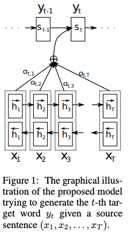

对于输入句子的每一个单词$x_t$，经过双向RNN block（常用的有LSTM、GRU）后获得对应的encoder output $h_t$，在decoder阶段，时刻t的decoder state需要关注整个句子的上下文信息，从中判断出哪些比较重要，重要的进行保留。一个很合理的想法就是对于encoder阶段得到的每一个word的output，赋予一个权重，这里的核心就是权重的计算，即score function的计算，论文中采用的是经典的加法操作，被称之为**additive attention**：

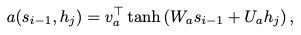

这个公式也有写法，因此也被称之为**concat attention**：
$$
\text{score}(\boldsymbol{s}_t, \boldsymbol{h}_i) = \mathbf{v}_a^\top \tanh(\mathbf{W}_a[\boldsymbol{s}_t; \boldsymbol{h}_i])
$$
这里$s_{t-1}$表示上一时刻的hidden state，$h_j$表示当前的encoder output，$W_a \in \R^{n \times n}$和$U_a \in \R^{n \times 2n}$分别是两个线性变换的参数矩阵，经过tanh激活函数和线性变换后得到当前时刻decoder的attention $e_{ij}$。这个attention经过normalization（多用softmax函数）后得到attention weights $\alpha_{ij}$：

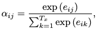

attention weights和encoder output相乘并求和得到context vector：

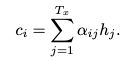

2015年 EMNLP 《Effective Approaches to Attention-based Neural Machine Translation》在基础 attention 上开始研究一些变化操作，尝试不同的 score-function，不同的 alignment-function。文章中使用的 Attention（**multiplicative attention** 或者 又叫 Luong attention）结构也被广泛应用。
$$
\text{score}(\boldsymbol{s}_t, \boldsymbol{h}_i) = \boldsymbol{s}_t^\top\mathbf{W}_a\boldsymbol{h}_i
$$
式中，$W_a$是attention layer中需要训练的权重矩阵。

2015年 ICML 《Show, Attend and Tell: Neural Image Caption Generation with Visual Attention》是 attention（提出hard/soft attention的概念）在 image caption 上的应用，2016和2017年 attention 各种花式操作层出不穷，Hiearchical Attention，Attention over Attention，multi-step Attention……

2017年-至今是属于 transformer 的时代。基于 transformer 强大的表示学习能力，NLP 领域爆发了新一轮的活力，BERT、GPT 领跑各项 NLP 任务效果。奠基之作无疑是：2017年 NIPS的《Attention is all you need》，论文提出了 transformer 的结构（涉及 self-attention，multi-head attention）。基于 transformer 的网络可全部替代sequence-aligned 的循环网络，实现 RNN 不能实现的并行化，并且使得长距离的语义依赖与表达更加准确（据说2019年的 transformer-xl《Transformer-XL：Attentive Lanuage Models Beyond a fixed-length context》通过片段级循环机制结合相对位置编码策略可以捕获更长的依赖关系）。

## What is Attention?

Attention的类型这么多，在读paper的时候不免让人眼花缭乱，但是，归根到底，所有的Attention都可以用三个阶段来表示：score function --> alignment function --> generate context vector function，翻译过来即先计算分数，然后进行对齐，最后计算上下文向量，一个典型的Attention模块如下图所示：

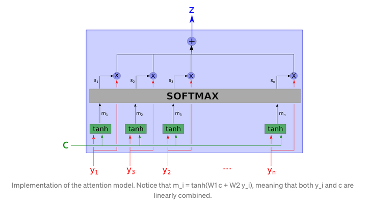

分解一下：

* score function：计算当前输入向量和一些坐标向量的权重，计算方式灵活；
* alignment function：计算attention weight，使得坐标向量中重要的部分权重较大，一般采用softmax；
* generate context vector function：根据attention weight，计算上下文向量，与坐标向量对齐。

可以看出，Attention的最灵活的部分就在于score function的计算，论文对Attention进行魔改也多集中在此，这一过程可以类比于给定一个query，计算该query与一系列key的相似性，最后利用相似性和value计算得到final vector。

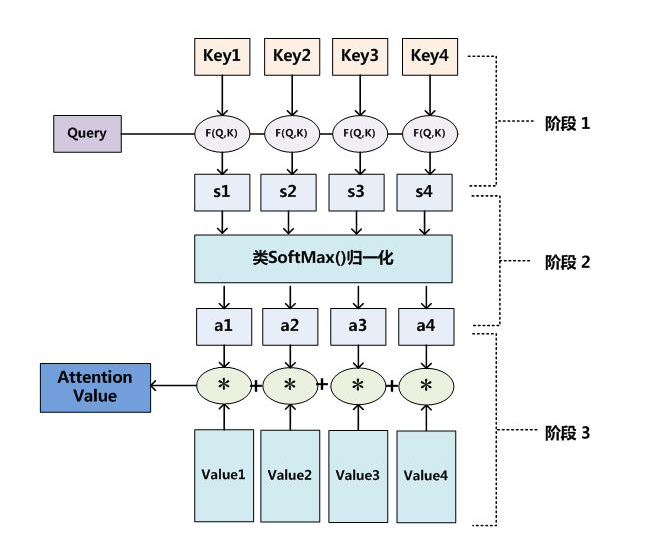

这其实也就描述了Attention的本质：**Attention 机制的实质其实就是一个寻址（addressing）的过程**，如上图所示：给定一个和任务相关的查询 Query 向量 q，通过计算与 Key 的注意力分布并附加在 Value 上，从而计算 Attention Value，这个过程实际上是 **Attention 机制缓解神经网络模型复杂度的体现**：不需要将所有的 N 个输入信息都输入到神经网络进行计算，只需要从 X 中选择一些和任务相关的信息输入给神经网络。

> *从上面的建模，我们可以大致感受到 Attention 的思路简单， **四个字“带权求和”就可以高度概括*** ，大道至简。做个不太恰当的类比，人类学习一门新语言基本经历四个阶段：死记硬背（通过阅读背诵学习语法练习语感）->提纲挈领（简单对话靠听懂句子中的关键词汇准确理解核心意思）->融会贯通（复杂对话懂得上下文指代、语言背后的联系，具备了举一反三的学习能力）->登峰造极（沉浸地大量练习）。
>
> *这也如同attention的发展脉络，RNN 时代是死记硬背的时期，attention 的模型学会了提纲挈领，进化到* *[transformer](https://easyai.tech/ai-definition/transformer/)*，融汇贯通，具备优秀的表达学习能力，再到 GPT、BERT，通过多任务大规模学习积累实战经验，战斗力爆棚。
>
> *要回答为什么 attention 这么优秀？是因为它让模型开窍了，懂得了提纲挈领，学会了融会贯通。*

## Attention的分类

Attention的类型[1]：

1. 根据计算区域：

   * Soft Attention：

     这是比较常见的Attention方式，对所有key求权重概率，每个key都有一个对应的权重，是一种全局的计算方式（也可以叫Global Attention）。这种方式比较理性，参考了所有key的内容，再进行加权。但是计算量可能会比较大一些。

   * Hard Attention：

     这种方式是直接精准定位到某个key，其余key就都不管了，相当于这个key的概率是1，其余key的概率全部是0。因此这种对齐方式要求很高，要求一步到位，如果没有正确对齐，会带来很大的影响。另一方面，因为不可导，一般需要用强化学习的方法进行训练。（或者使用gumbel softmax之类的）

   * Local Attention：

     这种方式其实是以上两种方式的一个折中，对一个窗口区域进行计算。先用Hard方式定位到某个地方，以这个点为中心可以得到一个窗口区域，在这个小区域内用Soft方式来算Attention。

2. 根据所用信息：

   这个分类主要是根据Attention计算时的query、key和value的来源

   * General Attention：通常所指的Attention，query ！= key， key = value，
   * Local Attention(Self Attention)，在论文《Attention is All You Need》中提出，query = key = value，即计算Attention只用了自身的信息。

3. 根据结构层次：

   结构方面根据是否划分层次关系，分为单层attention，多层attention和多头attention：

   1）单层Attention，这是比较普遍的做法，用一个query对一段原文进行一次attention。

   2）多层Attention，一般用于文本具有层次关系的模型，假设我们把一个document划分成多个句子，在第一层，我们分别对每个句子使用attention计算出一个句向量（也就是单层attention）；在第二层，我们对所有句向量再做attention计算出一个文档向量（也是一个单层attention），最后再用这个文档向量去做任务。

   3）多头Attention，这是Attention is All You Need中提到的multi-head attention，用到了多个query对一段原文进行了多次attention，每个query都关注到原文的不同部分，相当于重复做多次单层attention：

4. * 单层Attention
   * 多层Attention
   * 多头Attention

* **下表总结了几个常见的Attention计算方式**：

|          Name          |                   Alignment score function                   | 描述                                                       |                           Citation                           |
| :--------------------: | :----------------------------------------------------------: | ---------------------------------------------------------- | :----------------------------------------------------------: |
| Content-base attention | 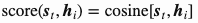 | 余弦相似性                                                 |        [Graves2014](https://arxiv.org/abs/1410.5401)         |
|      Additive(*)       | 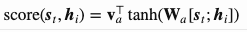 | concat，然后进行线性变换                                   |     [Bahdanau2015](https://arxiv.org/pdf/1409.0473.pdf)      |
|     Location-Base      | 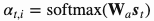 | 直接线性变换                                               |      [Luong2015](https://arxiv.org/pdf/1508.04025.pdf)       |
|        General         | 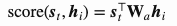 | multiplicative attention，先做线性变换，再点积             |      [Luong2015](https://arxiv.org/pdf/1508.04025.pdf)       |
|      Dot-Product       | 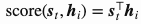 | 直接计算点积，最简单，当query和key在同一空间下可以这样计算 |       [Luong2015](https://arxiv.org/pdf/1508.4025.pdf)       |
| Scaled Dot-Product(^)  | 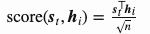 | 点积的基础上乘以缩放因子，n为source的hidden state的维度    | [Vaswani2017](http://papers.nips.cc/paper/7181-attention-is-all-you-need.pdf) |

## Attention in Transformer 

### Q&A

1. attention的优缺点：
   * 优点：
     * 能够建模长距离依赖：对于序列中的每一步，计算attention时都要利用到全局的信息，从公式可以看出，这一过程不再考虑元素之间的距离，能够一步到位，计算元素之间的依赖关系。RNN会随着步长的增加，长距离依赖关系逐渐减弱，而attention不会。
     * 能够并行计算：与RNN不同，每一步计算attention并不依赖上一步的输出，因此attention可以做到并行计算；
     * 模型复杂度小，计算量小。
   * 缺点：
     * attention不是“distance-ware”的，也就是不考虑元素之间的顺序关系，但是这个顺序关系在一些场景下是非常重要的，这一点在transfprmer中加入position encoding可以解决。

参考链接：

[1]. [一文看懂-attention-本质原理-3大优点-5大类型](https://easyaitech.medium.com/%E4%B8%80%E6%96%87%E7%9C%8B%E6%87%82-attention-%E6%9C%AC%E8%B4%A8%E5%8E%9F%E7%90%86-3%E5%A4%A7%E4%BC%98%E7%82%B9-5%E5%A4%A7%E7%B1%BB%E5%9E%8B-e4fbe4b6d030)

[2]. [Attention? Attention!](https://lilianweng.github.io/lil-log/2018/06/24/attention-attention.html)

[3]. [遍地开花的 Attention，你真的懂吗？](https://zhuanlan.zhihu.com/p/77307258)

[4]. [探索 NLP 中的 Attention 注意力机制及 Transformer 详解](https://www.infoq.cn/article/lteUOi30R4uEyy740Ht2)

