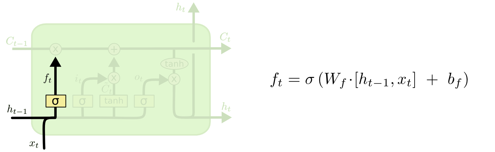

# Seq2Seq模型和attention总结

[TOC]

## 前言

在机器学习和深度学习的领域中，计算机所处理的数据根据数据类型可以分成三类：

* 静态数据（statics data）：如图像，结构化数据，处理图像数据的经典模型是CNN，结构化数据则多用machine learning方法进行分类
* 时间序列数据（Time Series Data）：沿着时间的维度发生变化的数据，连续值如股票价格，离散值如文本数据，对于时序数据，常用的模型有MA（滑动平均），HMM，RNN/LSTM，以及近两年的Transformer。
* 图结构数据（Graph Data）：数据由网络结构组成，如社交网络，处理这类数据常用的模型有Network Embedding（Node2Vec）、Graph Embedding（GNN），Knowledge Embedding（Knowledge Graph）

如果将静态数据看作一个点，那么时间序列可以看作一条线，图数据看作一个面，依次是一个包含与被包含的关系。

RNN和LSTM是处理时间序列数据最经典的模型，也是Seq2Seq模型结构常用的encoder和decoder部分。

## RNN

对于每一个时刻的输入x，首先将其表征成向量的形式，然后传递给一个隐含层模块，产生当前时刻的预测输出$\hat{y}$，当前隐含层的状态h会传递给下一时刻的隐含层，这样就可以是模型学习到之前时刻的信息。真实y与预测$\hat{y}$产生loss，利用loss训练模型得到模型参数，最后一个时刻的h用于进行决策。

这就是最经典的RNN模型。

## RNN vs HMM

RNN与HMM模型在结构上是很相似的，都可以用来处理时间序列数据，但是是两个完全不同的模型，一个是传统机器学习的经典模型，一个是深度学习的经典模型。

HMM包括状态转移矩阵$(h_1' \rightarrow h_2')$，状态发射矩阵$(h_1' \rightarrow x_1)$，h和x分别是隐状态和观测状态，h一般用one-hot向量表示，维数为隐状态的个数；RNN中的h理解为向量的分布式表示，h的维数受到hidden size的控制，当前时刻的隐状态向量由上一时刻的隐状态向量和输入向量共同决定。

二者的学习目标也不相同，HMM学习的是状态转移矩阵和状态发射矩阵，而RNN学习的是三个参数矩阵$W_{xh}, W_{hh}, W_{hy}$。

## RNN for LM

假设我们有一文本$S=(w_1, w_2, ..., w_n)$，语言模型就是要去计算这一文本发生的概率，即
$$
p(s)=p(w1)p(w2|w1)p)(w2|w1,w2)\cdots p(w_n|w_1, w_2, \dots, w_{n-1})
$$
根据是否考虑前n个单词可以将语言模型划分成n-gram模型，RNN在文本建模的过程中可以看作是一个bigram，即对于每一个词，只考虑前一个单词。

假如我们有"I like his NLP course."这样一条文本，RNN的每一时刻的输入是第n个单词，输出是下一个单词的预测结果，对应的是softmax分布，向量的维度是vocabulary的大小。根据RNN的输出和目标输出可以计算交叉熵loss，从而不断优化概率分布。

## 梯度消失/爆炸

为了简化，假设我们有上面这一RNN模型，图中$x_t, \hat{y_t}, h_t, J^{(t)}(\theta)$分别表示第t时刻的l输入，预测输出，隐含层状态和loss，那么有
$$
loss =\sum_t J^{(t)}(\theta)
$$

$$
h_t=f(w_{hh}h_{t-1}+w_{xh}x_t + b1)
$$

现在要对loss求隐含层的梯度
$$
\frac{\partial J^{(4)}(\theta)}{\partial h_1}=\frac{\partial J^{(4)}(\theta)}{\partial h_4}\frac{\partial h_4}{\partial h_1}=\frac{\partial J^{(4)}(\theta)}{\partial h_4}\frac{\partial h_4}{\partial h_3}\frac{\partial h_3}{\partial h_2}\frac{\partial h_2}{\partial h_1} \\
\frac{\partial h_t}{\partial h_{t-1}}=diag(\sigma'(w_{hh}h_{t-1}+w_{xh}x_t + b_1))\cdot \ w_{hh}
$$
一般化，可得，第i时刻的loss对第j时刻的h的梯度等于：
$$
\begin{align}
\frac{\partial J^{(i)}(\theta)}{\partial h_j} &= \frac{\partial J^{(i)}(\theta)}{\partial h_i} \prod_{j< t<=i}\frac{\partial h_t}{\partial h_{t-1}} \\
&= \frac{\partial J^{(i)}(\theta)}{\partial h_i}\prod_{j< t<=i}diag(\sigma'(w_{hh}h_{t-1}+w_{xh}x_t + b_1)))\cdot w_{hh} \\
&= \frac{\partial J^{(i)}(\theta)}{\partial h_i} w_{hh}^{i-j}\prod_{j< t<=i}diag(\sigma'(w_{hh}h_{t-1}+w_{xh}x_t + b_1))) 
\end{align}
$$
因为是一系列梯度的乘积，所以结果上可能会存在梯度的问题，梯度为0或者无穷大，即梯度消失或梯度爆炸。

> 在反向传播过程中，用于训练参数的错误信号随着距离的增加会呈指数级减小。这个问题的直接后果就是靠近输入层的一些层的参数很少会更新。对于RNN(可以展开，看成是共享参数的前馈神经网络)，这个问题意味着不能捕获长距离依赖。

* gradient explode： gradient clipping
* gradient vanishing：LSTM

long-term dependency：长依赖，比如模型通过计算计算h7到h2的梯度，能捕获第七个词到第二个词之间的关系，那么正确计算二者的梯度就显得尤为重要。如果不能正确计算，说明模型不能很好的捕获长依赖关系。

## LSTM

LSTM（Long Short Term Memory Network，长短期记忆网络）

主要目的：缓解RNN的梯度消失问题

基本思想：为了缓解RNN的梯度问题，同时为了能够较好地捕获长依赖的关系，LSTM在RNN的基础上增加了门机制（gate），使得网络可以有选择的遗忘一些不重要的信息，从而记住更加重要的信息。

* forget gate（遗忘门）：$f_{t}=\sigma _{g}(W_{f}x_{t}+U_{f}h_{t-1}+b_{f})$

  

* input gate（输入门）：$i_{t}=\sigma _{g}(W_{i}x_{t}+U_{i}h_{t-1}+b_{i})$ ，计算输入信息中有多少需要记住，产生新的信息$\hat{C_t}$

  

* cell状态：选择要从上一时刻的信息中遗忘和记住的部分

* output gate（输出门）: $o_{t} =\sigma _{g}(W_{o}x_{t}+U_{o}h_{t-1}+b_{o})$

  

question: 为什么LSTM可以缓解RNN梯度消失的问题？

https://weberna.github.io/blog/2017/11/15/LSTM-Vanishing-Gradients.html

要理解为什么当使用全部LSTM梯度时，结果没有实质性的变化，需要看看在此时递归梯度计算发生了什么。如前所述，递归梯度计算是导致梯度消失的元凶，所以让我们对 ![[公式]](https://www.zhihu.com/equation?tex=%5Cfrac%7B%5Cpartial+C_%7Bt%7D%7D%7B%5Cpartial+C_%7Bt-1%7D%7D) 展开全部的梯度.首先，回忆一下LSTM计算公式， ![[公式]](https://www.zhihu.com/equation?tex=C_%7Bt%7D) 是 ![[公式]](https://www.zhihu.com/equation?tex=i_%7Bt%7D%2Cf_%7Bt%7D%2C%5Ctilde%7BC_%7Bt-1%7D%7D) 的函数，而他们又都是 ![[公式]](https://www.zhihu.com/equation?tex=C_%7Bt-1%7D) 的函数（因为都是 ![[公式]](https://www.zhihu.com/equation?tex=h_%7Bt-1%7D)的函数 ）。通过多变量的链式求导法则，我们可以得到：

![[公式]](https://www.zhihu.com/equation?tex=%5Cfrac%7B%5Cpartial+C_%7Bt%7D%7D%7B%5Cpartial+C_%7Bt-1%7D%7D%3D%5Cfrac%7B%5Cpartial+C_%7Bt%7D%7D%7B%5Cpartial+f_%7Bt%7D%7D%5Cfrac%7B%5Cpartial+f_%7Bt%7D%7D%7B%5Cpartial+h_%7Bt-1%7D%7D%5Cfrac%7B%5Cpartial+h_%7Bt-1%7D%7D%7B%5Cpartial+C_%7Bt-1%7D%7D%2B%5Cfrac%7B%5Cpartial+C_%7Bt%7D%7D%7B%5Cpartial+i_%7Bt%7D%7D%5Cfrac%7B%5Cpartial+i_%7Bt%7D%7D%7B%5Cpartial+h_%7Bt-1%7D%7D%5Cfrac%7B%5Cpartial+h_%7Bt-1%7D%7D%7B%5Cpartial+C_%7Bt-1%7D%7D%2B%5Cfrac%7B%5Cpartial+C_%7Bt%7D%7D%7B%5Cpartial+%5Ctilde%7BC_%7Bt-1%7D%7D%7D%5Cfrac%7B%5Cpartial+%5Ctilde%7BC_%7Bt-1%7D%7D%7D%7B%5Cpartial+h_%7Bt-1%7D%7D%5Cfrac%7B%5Cpartial+h_%7Bt-1%7D%7D%7B%5Cpartial+C_%7Bt-1%7D%7D%2B%5Cfrac%7B%5Cpartial+C_%7Bt%7D%7D%7B%5Cpartial+C_%7Bt-1%7D%7D)

可以简化一下：

![[公式]](https://www.zhihu.com/equation?tex=%5Cfrac%7B%5Cpartial+C_%7Bt%7D%7D%7B%5Cpartial+C_%7Bt-1%7D%7D%3DC_%7Bt-1%7D%5Csigma%5E%7B%27%7D%28.%29W_%7Bf%7D%2Ao_%7Bt-1%7Dtanh%28C_%7Bt-1%7D%29%2B%5Ctilde%7BC_%7Bt%7D%7D%5Csigma%5E%7B%27%7D%28.%29W_%7Bi%7D%2Ao_%7Bt-1%7Dtanh%28C_%7Bt-1%7D%29%2Bi_%7Bt%7Dtanh%5E%7B%27%7D%28.%29W_%7Bc%7D%2Ao_%7Bt-1%7Dtanh%28C_%7Bt-1%7D%29%2Bf)

现在，如果我们要计算时刻k的,简单的利用上式进行乘k次即可。递归梯度计算上，LSTM与原始RNN最大的不同之处在于，在原始RNN中 ![[公式]](https://www.zhihu.com/equation?tex=%5Cfrac%7B%5Cpartial+h_%7Bt%7D%7D%7B%5Cpartial+h_%7Bt-1%7D%7D) 会一直大于1或者在[0,1]区间，这会导致梯度爆炸或者消失。在 ![[公式]](https://www.zhihu.com/equation?tex=%5Cfrac%7B%5Cpartial+C_%7Bt%7D%7D%7B%5Cpartial+C_%7Bt-1%7D%7D) 中，每个时刻都可以时大于1或者在[0,1]区间，所以当考虑无穷大的时刻，LSTM不会趋于0或者无穷大。当要收敛到0时，可以增大遗忘门 ![[公式]](https://www.zhihu.com/equation?tex=f_%7Bt%7D) ,使得它能把 ![[公式]](https://www.zhihu.com/equation?tex=%5Cfrac%7B%5Cpartial+C_%7Bt%7D%7D%7B%5Cpartial+C_%7Bt-1%7D%7D) 的值拉向1.这就可以减缓梯度消失（也就是梯度不会太快的消失）。一个重要的地方是 ![[公式]](https://www.zhihu.com/equation?tex=f_%7Bt%7D%2Ci_%7Bt%7D%2Co_%7Bt%7D%2C%5Ctilde%7BC_%7Bt%7D%7D) 都是神经网络自己学习到的。所以说，神经网络会通过学习改变门控的值来决定什么时候遗忘梯度，什么时候保留梯度。

### LSTM的变体—GRU

实际上就是把门的数量缩减到了2个。

### Bi-directional LSTM（双向LSTM，**biLSTM**）

在一些场景下，需要同时考虑上下文关系，比如词性标注，预测一个word的词性的时候需要考虑这个词左边和右边的word，但是传统的RNN和单向的LSTM只考虑了单向的关系，不能捕获上下文关系，这也是双向LSTM提出的初衷，训练biLSTM的时候等同于同时训练两个方向相反的LSTM，两个LSTM参数不共享，这样就可以同时捕获一个word的上下文信息。

 

## Seq2Seq

Seq2Seq模型是一种通用的模型框架，包括encoder和decoder两部分，广泛用于文本生成等场景中

在NLP中，encoder部分负责文本理解，decoder负责文本生成，encoder和decoder之间通过context vector连接。

encoder部分的是需要理解的文本，产生的最后一个隐含层的向量直接作为context vector，作为decoder部分的t0时刻的输入，decoder接下来每一个时刻的输入是上一个时刻预测的输出。

看一下细节部分，假如我们有“今天 天气 很 好”这样一段文本，我们想要模型输出"Today's weather is good."

训练过程中，我们首先给encoder部分输入原始的word序列，经过编码后生成context vector，然后输入一个特殊word“<START>”，表示一句话的开始位置，decoder部分会输出一个维数为vocab大小的概率分布向量，经过softmax后得到对应的预测输出，这一输出会作为下一时刻的输入，直至模型遇到"<END>"，表示一句话结束。decoder部分的预测输出和目标输出计算得到loss，经反向传播更新模型参数梯度。

### [Beam Search](https://www.zhihu.com/question/54356960)

在上面的例子中，在inference阶段，模型在decode时，每时每刻只考虑概率最大的那个输出，这个叫greedy decoding，这种解码方式存在明显的问题，即没有考虑全局的概率最优，每时每刻只选择一个最好的词未必是optimizer。

inference阶段常用的方法是beam search。Beam search的原理其实也很简单，基本思想就是每时每刻考虑topK个可能性，实际使用中也只需要设置beam_size这一个参数，通过调节这个参数即可在推断时间和准确率之间取得一个平衡，当beam_size为1时，等价于贪心搜索

> By default, translation is done using beam search. The `-beam_size` option can be used to trade-off translation time and search accuracy, with `-beam_size 1` giving greedy search. The small default beam size is often enough in practice.

如下图所示：

不难看出，beam search的时间复杂度为O(T·K^2)，T为句子长度或者经历多少时刻。

理解beam search其实就是在贪心搜索和穷举搜索进行一个折中。但是实际应用中会发现beam search会偏向于长度较短的序列，因此一般会除以一个句子长度作为惩罚项。

### beam search 优化

链接：https://opennmt.net/OpenNMT/translation/beam_search/

**Normalization正规化**
$$
s(Y,X)=\frac{\log P(Y|X)}{lp(Y)}+cp(X,Y)
$$
式中，X 是source，Y是current target。

* **length normalization**
  $$
  lp(Y) = \frac{(5+|Y|)^\alpha}{(5+1)^\alpha}
  $$
  式中，$|Y|$是current target length，$\alpha$是 length normalization系数。

* **Coverage normalization**
  $$
  cp(X,Y) = \beta\sum_{i=1}^{|X|}\log(\min(\sum_{j=1}^{|Y|}p_{i,j},1.0))
  $$
  式中，$p_{i,j}$是第i个source word$x_i$的第j个target word$y_j$的atttention概率，$|X|, |Y|$分别是source和target的length，$\beta$是**coverage normalization**系数。

* **End of sentence normalization**
  $$
  ep(X,Y)=\gamma\frac{|X|}{|Y|}
  $$
  对输入输入句子长度进行惩罚。

## Attention注意力机制

Attention机制的核心是计算出输入的句子中每个单词的重要性，使得模型的注意力能够集中在更重要的信息上，理解attention的核心操作就是做了一个softmax。

简要描述一下attention过程：

首先，给定一个单词序列，如上图中的“今天 天气 很 好”，经过embedding后输入到encoder，那么会产生4个隐含层向量，可以想象，当模型预测输出第一个word时，其实只需要关注第一个词“今天”就可以了，也就是说“今天”的重要性会比较大，那么如何刻画这一重要性呢，想到直接利用decoder的隐藏层向量与encoder部分的隐藏层向量进行点积，作为该时刻的decoder与每一时刻的encoder的关联程度，或者说每一时刻的encoder对当前decoder的输出的重要程度，由于点积是一个实数，由点积构成的score向量经过softmax归一化操作，使得点积的分布趋于[0,1]之间，这一重要程度（权重）再乘以当前encoder的隐藏层向量，累加后得到decoder当前时刻的context vector，和input合并起来经过非线性映射就得到了当前时刻的预测输出。经过训练，模型在每一步预测的时候就会把注意力放到对输出更重要的信息上。

## GRU

## sample_softmax

https://colah.github.io/posts/2015-08-Understanding-LSTMs/

