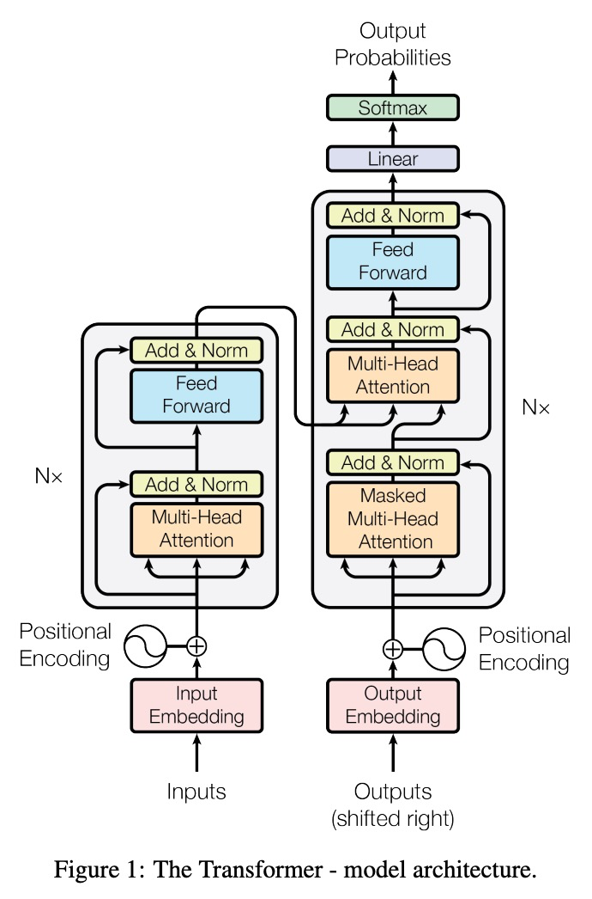
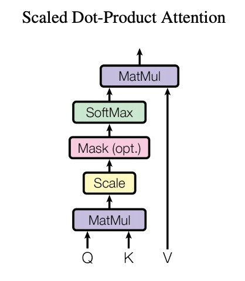
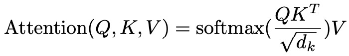
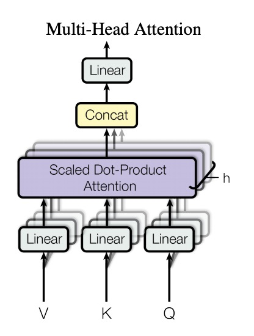
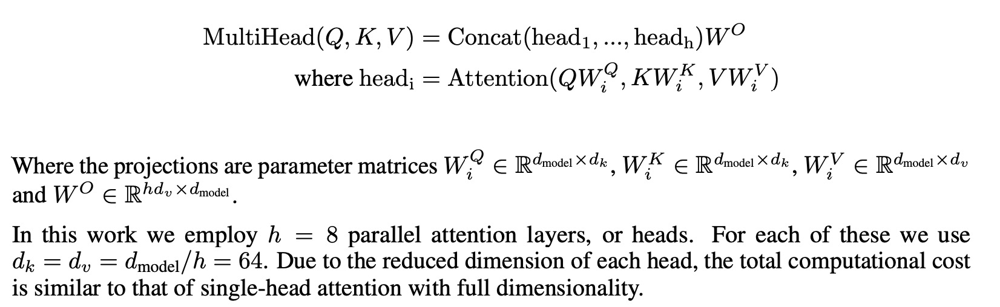
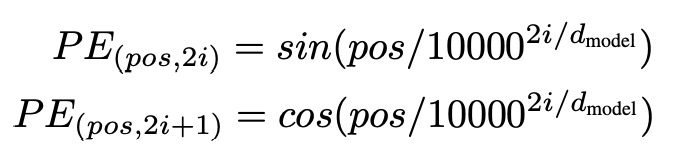

# Transformer学习--Attention is all you need

[TOC]

## Background

在 [NLP之NLP中的Attention机制总结](NLP之NLP中的Attention机制总结.md) 中对attention方法进行了总结，本文将聚焦于Transformer，transformer利用attention思想加速模型训练速度，并在NLP各个基础任务中已经取代了传统的seq2seq结构，可谓是NLP发展史上的里程碑式模型。

Transformer是由论文 [Attention is All You Need](https://arxiv.org/abs/1706.03762)提出的，最早用于机器翻译领域，如下图所示：

输入是一个句子，输出也是一个句子，所以tansformer内部也是一个encoder-decoder结构。

其中，encoder部分(decoder部分)分别由N个encoder block(decoder block)堆叠而成（paper中N=6），每一个block在结构上都是完全一致的

## Model Architecture

Transformer的整个模型结构如下：

### Encoder

我们先来拆解一下encoder部分，encoder包括两个部分：Multi-Head Attention和Feed Forward NN，这里的重点是attention部分，中文翻译是多头注意力机制。input sequence中每一个位置的单词经过embedding后，首先输入到attention层，该层可以帮助编码器在对特定单词进行编码时查看输入句子中的其他单词，然后attention的输出经过sublayer（Add & Norm）后作为position-wise前馈神经网络层的输入，最后输出每一个位置上特定单词的encoder representation，作为下一个encoder block的input。

#### Scaled Dot-Product Attention

> An attention function can be described as mapping a query and a set of key-value pairs to an output,
> where the query, keys, values, and output are all vectors. The output is computed as a weighted sum
> of the values, where the weight assigned to each value is computed by a compatibility function of the
> query with the corresponding key.
>
> 一个attention函数可以看作是将query和key-value集合映射到output的过程，这里的query、keys、values和output都是向量的形式。output是values的加权求和，每一个weight经过query和对应的key进行相似性计算获得。

Encoder中的self attention用的是Multi-Head Attention的形式，而Multi-Head Attention实质上是由多个Scaled Dot-Product Attention的结果concat而成的，所以我们首先来看一下Scaled Dot-Product Attention，中文翻译是缩放点积注意力机制。结构如下所示：

* 这里的Q、K、V分别是query、keys、values的矩阵形式，分别由输入矩阵X经过矩阵($W_Q,W_K,W_V$)运算得到；
* scale的做法是对Q、K经过矩阵乘法的结果进行缩放，论文中的做法是除以$\sqrt{d_k}$，这里的$d_k$是矩阵K的维度;
* 论文中使用的是点积attention（dot attention），这里不用additive attention（加性attention）的理由是点积attention运算速度更快，计算复杂度相对低，并且能够用于高度优化后的矩阵乘法运算；
* 当$d_k$较小时，两种attention计算方式效果几乎一致，但是当$d_k$较大时，加性Attention比没有经过缩放的点积Attention表现更加出色；
* 论文作者认为当$d_k$较大时，点积在量级上变化很大，容易使得softmax函数梯度较小；

Scaled Dot-Product Attention的计算公式：

#### Self-Attention in Detial 

假设现在有一句话“The animal didn't cross the street because it was too tired”，很显然这里的“it”指代的是“animal”，对于人来说这是一个很简单的问题，但是对于计算机来说却有点难度。Self Attention在这里做的事情就是使得模型在处理“it”这个单词时能够把注意力集中在“animal”上，即模型在处理句子中的每一个单词时，Self- Attention能够允许模型观察输入序列中的其他位置上的单词，使得模型能够对当前位置的单词进行更加准确的编码。那么这里的query就是当前位置的档期，keys和values均是该句话其他所有位置的单词，因为是自己和自己计算相似性，所以称之为Self-Attention，自注意力机制。

现在从矩阵计算的角度出发看一看Self-Attention的计算过程：

假设现在有两个单词“Thinking”和“Machines”，分别通过某种方法获得对应的embedding x1和x2，模型首先会初始化三个训练参数矩阵$W^Q,W^K,W^V$，x分别于三个矩阵进行乘法运算获得三个向量，三个向量分别是query、key和value向量，如下图所示：

第二步利用上面的query向量与keys向量计算自注意力作为每一个key的分数，计算相似性的方法有很多，这里直接利用点积运算相对简单，

第三和第四步是将分数除以$\sqrt{d_k}$（论文中为8）。这能够使得梯度更稳定。然后将结果通过softmax对分数进行归一化，使所有分数均为正，加起来为1。

softmax分数决定了当前单词对于query的贡献度是多少，或者对于query，模型应该从当前位置获取多少知识。当前位置的单词越重要，注意力值就越高。

第五步和第六步是将attention与value向量进行点积，然后将点积结果对应位置求和（带权求和）。这一步的作用是可以使得模型注意到更相关的内容，从而遗忘掉一些不相关的信息。

将上述过程总结成矩阵运算，即

公式：
$$
Attention(Q,K,V)=softmax(\frac{QK^T}{\sqrt{d_k}})V
$$
除以dimension $\sqrt{d_k} $的原因:

除以的原因是防止在QK计算乘积的时候数值过大造成上溢出。我们都知道softmax函数在x越大的时候越接近与1。不同数之间计算的结果差异就会变小。除以可以帮助解决这个问题。

#### Multi-Head Attention

论文中采用的是多头注意力机制，实质就是拿Q、K、V 进行多次缩放点积注意力计算，然后把每次的结果concat起来，接一个linear层投射到$d_{model}$维度。

采用多头注意力能够从两个方面提高attention layer的表现：

1. 多头注意力扩展了模型专注于不同位置的能力。在上面的示例中，z1包含所有其他位置编码的一点信息，但是它可能由实际单词本身决定，采用多头注意力更多是的模型获取更多来自于其他位置的信息。
2. 为attention layer提供了多个“表示子空间”，在多头关注下，我们不仅拥有一个查询，而且具有多组查询/键/值权重矩阵（Transformer使用八个关注头，因此每个编码器/解码器最终得到八组） 。这些集合中的每一个都是随机初始化的。然后，在训练之后，将每个集合用于将输入的嵌入（或来自较低编码器/解码器的矢量）投影到不同的表示子空间中。

具体过程如下：

首先，会随意初始化多个$W^Q,W^K,W^V$参数矩阵，论文中head数量为8，所以一共初始化24个矩阵，这些矩阵分别于input embeddings计算得到对应的Q、K和V，各8个；

Next，分别拿这8组（Q，K，V）计算Self-Attention，得到8个$Z_i$矩阵，每一个矩阵的维度是$\R^{s\times d_v}$，这里的s是sequence长度，$d_v$是V参数矩阵的列维度。

concat起来，即$Z_{concat}=concat(Z_0, Z_1, ...,Z_7)，Z_{concat}\in\R^{s \times hd_v}$;

 最后，concat矩阵经过线性层，计算得到最终的$Z \in \R^{s \times d_{model}}$。整个可视化过程如下：

#### Add&Norm

从Transformer结构中可以看到，在每两个block之间，均采用了Add & Norm的连接方式，这里是利用了residual connection（残差连接）的思想，然后followed by [layer-normalization](https://arxiv.org/abs/1607.06450) 。

这么做的好处是可以保持原有信息，扩展encoder和decoder部分的深度。

layer-normalization公式：
$$
LN(x_i) = \alpha * \frac{x_i-\mu_L}{\sqrt{\sigma^2_L+\varepsilon}}+\beta
$$

#### Positional Encoding 

Positional Encoding（位置编码）是Transformer中另外一个比较重要的细节。到目前为止，我们描述的模型中缺少的一件事是一种解释输入序列中单词顺序的方法。为解决此问题，Transformer向每个输入嵌入添加了一个向量。这些向量遵循模型学习的特定模式，这有助于确定每个单词的位置或序列中不同单词之间的距离。直觉上来看，将这些值添加到embedding中后，一旦将它们投影到Q / K / V向量中，并且在点积注意力计算期间，就可以在嵌入向量之间提供有意义的信息。

假设input embedding的维度是4，那么实际上的positional embedding将会看上去像下面这样：

论文中positional embedding的计算公式如下：

实际上，位置编码的模式是什么样呢？可视化结果如下所示，每一行表示一个位置编码的向量，每一行的size等于embedding的size，每一个值的取值范围是-1～1，一共10行，表示该句话有10个单词。 [Here’s the code to generate it](https://github.com/jalammar/jalammar.github.io/blob/master/notebookes/transformer/transformer_positional_encoding_graph.ipynb)

Encoders部分的细节基本上到这里就结束了，接下来看看Decoders部分。

### Decoder

整个Decoder与Encoder结构大体上一致，区别是在encoder的两个block（multi-head attention和position-wise fnn）之前加入了一个mask multi-head attention。

> The decoder is also composed of a stack of N = 6 identical layers. In addition to the two sub-layers in each encoder layer, the decoder inserts a third sub-layer, which performs multi-head attention over the output of the encoder stack. Similar to the encoder, we employ residual connections around each of the sub-layers, followed by layer normalization. We also modify the self-attention sub-layer in the decoder stack to prevent positions from attending to subsequent positions. This masking, combined with fact that the output embeddings are offset by one position, ensures that the predictions for position i can depend only on the known outputs at positions less than i

我们首先来看一下Encoder部分与Decoder部分是怎么连接的，下图很直观得展示了这一过程：

首先，整个input sequence是一次性输入到encoder部分的，不像RNN，当前输出需要依赖上一刻的输出，因此transformer在处理整个句子时，每一个单词的Q/K/V的计算都是并行的，这也就是训练速度加快的原因。

在整个encoder阶段结束后，encoder的输出会作为decoders中每一个decoder block的输入，直至最后一个block产生当前decoder的输出，经过Linear+softmax后得到当前位置的单词，并作为decoder下一时刻的输入input word。注意到，decoder阶段的输入和输出都是step by step的，或者说word by word，直到<eos>单词的出现。

#### Self-Attention in Decoder

注意到，Decoder中的attention与encoder中的attention是不太一致的，主要有两点：

1. 在decoder的输入端，采用的是**masked multi-head attention**，这里实质上就是对input embedding进行了mask操作，目的是避免decoder训练时模型看到当前位置之后的单词，防止信息泄露。一个很自然的想法就是，当模型开始翻译某一个句子时，在训练阶段，模型会有标准答案存在 ，但是我们希望在翻译某一个位置的单词时，模型只能够看到当前位置之前的信息，因此需要对当前位置之后的信息进行遮蔽操作，做法是在softmax前，将后面位置的对应的score置为-inf。

   > In the decoder, the self-attention layer is only allowed to attend to earlier positions in the output sequence. This is done by masking future positions (setting them to `-inf`) before the softmax step in the self-attention calculation.

2. encoder的输出会作为decoder中第二个Multi-Head Attention的K和V，同时Attention的Q来自于当前decoder的输入。

   > The “Encoder-Decoder Attention” layer works just like multiheaded self-attention, except it creates its Queries matrix from the layer below it, and takes the Keys and Values matrix from the output of the encoder stack.

### The Final Linear and Softmax Layer

这一个模块接在Decoders部分之后，接受Decoders的输出，产生预测的单词：

## Training

在训练期间，未经训练的模型将经过完全相同的前向计算。但是由于我们是在标记的训练数据集上对其进行训练，因此我们可以将其输出与实际正确的输出进行比较。

假设vocabulary中有6个单词，(“a”, “am”, “i”, “thanks”, “student”, and “<eos>” (short for ‘end of sentence’))，对于每一个word有一个index：

为了将每一个单词表征成vector的形式，这里简单的采用one-hoting编码，即：

在模型的训练阶段，每一步我们都需要计算损失函数以优化训练目标，在生成模型中，模型最后的输出是一个size为vocabulary大小的概率分布，向量中每一个概率值表示当前位置为对应单词的概率，假如当前时刻，我们的目标输出是“thanks”这个单词，由于模型的参数（权重）都是随机初始化的，因此（未经训练的）模型会针对每个单元格/单词生成具有任意值的概率分布。我们可以将其与实际输出进行比较，然后使用反向传播调整所有模型的权重，以使输出更接近所需的输出。

如何比较两个分布的差异呢？主要有两种方法：[cross-entropy，交叉熵](https://colah.github.io/posts/2015-09-Visual-Information/) 和 [Kullback–Leibler divergence，KL散度](https://www.countbayesie.com/blog/2017/5/9/kullback-leibler-divergence-explained)

训练过程中，我们需要的是生成一个序列。例如，输入：“ je suisétudiant”，预期输出：“i am a student”。这实际上意味着我们希望模型连续输出概率分布，其中：

* 每个概率分布都由一个宽度vocab_size的向量表示（在我们的示例中为6，但是实际上vocab_size的大小是成千上万的，例如30,000或50,000；
* 第一个概率分布在与单词“ i”相关的单元格处具有最高的概率；
* 第二个概率分布在与单词“ am”关联的单元格中具有最高概率；
* 依此类推，直到第五个输出分布指示“ <EOS>”符号，该符号也从vocabulary中与该单元格关联。

如下图所示：

在大量语料上训练足够多时间后，我们希望模型的结果如下所示：

## reference

[The Illustrated Transformer – Jay Alammar – Visualizing machine learning one concept at a time. (jalammar.github.io)](https://jalammar.github.io/illustrated-transformer/)

[The Annotated Transformer (harvard.edu)](http://nlp.seas.harvard.edu/2018/04/03/attention.html)

[Language Translation with Transformer — PyTorch Tutorials 1.8.1+cu102 documentation](https://pytorch.org/tutorials/beginner/translation_transformer.html#transformer)

