# NLP之对话系统及信息检索技术概览

[TOC]

## **对话系统**

* 对话系统的分类

  * **闲聊式对话系统**

    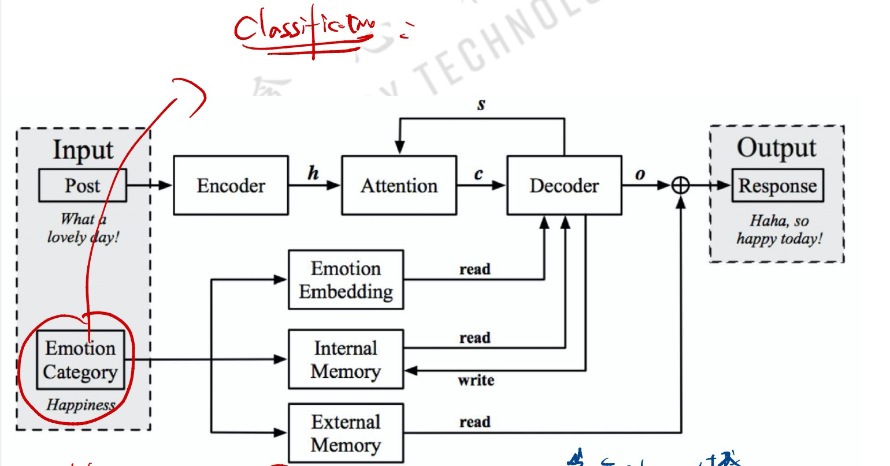

    一般需要先做意图识别，对输入文本进行分类：positive or negative，然后作为第一个token控制decoder的输出，是的输出的text符合情感类别。

  * **检索式对话系统**

    一般使用DB存储常见的问题Q，然后针对用户的输入，和数据库中的所有Q计算相似度，取相似度最高的Q的答案作为输出。

    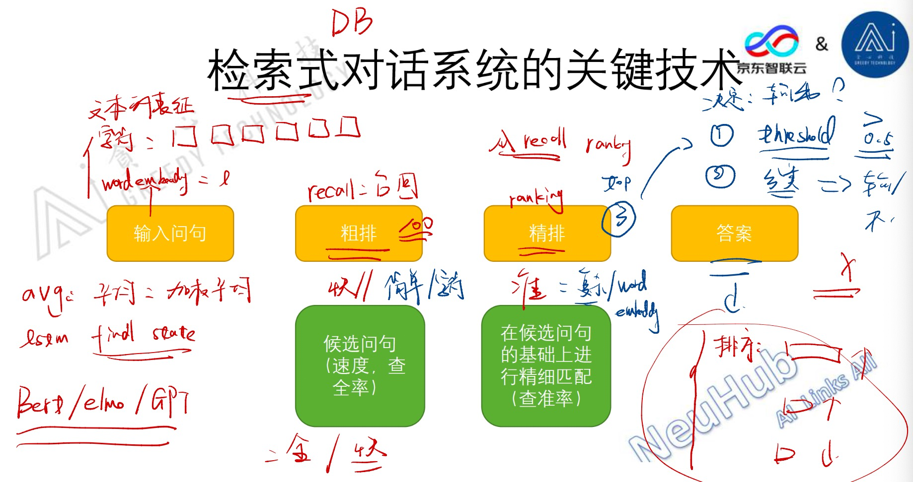

    

    相似度的计算：

    1. Jacard求交集
    2. Dot product求点积
    3. cosine similarity余弦相似性
    4. WMD（word move distance）
    5. model

  * **知识问答式对话系统**

  * **任务式对话系统**

    * 自然语言理解
    * 对话状态追踪
    * 对话策略
    * 自然语言生成

## **信息检索关键技术**

### 倒排索引

假设有这样一个场景，需要从海量的文档中搜索出包含“自然语言处理”的文档，一般的做法是建立正向索引（forward index），那么就需要扫描索引库中的所有文档，找出所有包含关键词“自然语言处理”的文档，再根据打分模型进行打分，排出名次后呈现给用户。**因为互联网上收录在搜索引擎中的文档的数目是个天文数字，**这样的索引结构根本无法满足实时返回排名结果的要求。这个时候，搜索引擎往往会先对海量数据建立倒排索引（Inverted Index），即把文件ID对应到关键词的映射转换为**关键词到文件ID的映射**，每个关键词都对应着一系列的文件，这些文件中都出现这个关键词。

倒排索引是一种用来快速进行全文索引的结构，是实现“单词-文档矩阵”的一种具体存储形式，一个倒排索引由文档中所有不重复的词的列表组成，对于每一个词，有一个包含它的文档列表。

例如，假设我们有两个文档，每个文档的 `content` 域包含如下内容：

1. The quick brown fox jumped over the lazy dog
2. Quick brown foxes leap over lazy dogs in summer

为了创建倒排索引，我们首先将每个文档的 `content` 域拆分成单独的 词（我们称它为 `词条` 或 `tokens` ），创建一个包含所有不重复词条的排序列表，然后列出每个词条出现在哪个文档。结果如下所示：

```
Term      Doc_1  Doc_2
-------------------------
Quick   |       |  X
The     |   X   |
brown   |   X   |  X
dog     |   X   |
dogs    |       |  X
fox     |   X   |
foxes   |       |  X
in      |       |  X
jumped  |   X   |
lazy    |   X   |  X
leap    |       |  X
over    |   X   |  X
quick   |   X   |
summer  |       |  X
the     |   X   |
------------------------
```

现在，如果我们想搜索 `quick brown` ，我们只需要查找包含每个词条的文档：

```
Term      Doc_1  Doc_2
-------------------------
brown   |   X   |  X
quick   |   X   |
------------------------
Total   |   2   |  1
```

两个文档都匹配，但是第一个文档比第二个匹配度更高。如果我们使用仅计算匹配词条数量的简单 *相似性算法* ，那么，我们可以说，对于我们查询的相关性来讲，第一个文档比第二个文档更佳。

但是，我们目前的倒排索引有一些问题：

- `Quick` 和 `quick` 以独立的词条出现，然而用户可能认为它们是相同的词。
- `fox` 和 `foxes` 非常相似, 就像 `dog` 和 `dogs` ；他们有相同的词根。
- `jumped` 和 `leap`, 尽管没有相同的词根，但他们的意思很相近。他们是同义词。

使用前面的索引搜索 `+Quick +fox` 不会得到任何匹配文档。（记住，`+` 前缀表明这个词必须存在。）只有同时出现 `Quick` 和 `fox` 的文档才满足这个查询条件，但是第一个文档包含 `quick fox` ，第二个文档包含 `Quick foxes` 。

我们的用户可以合理的期望两个文档与查询匹配。我们可以做的更好。

如果我们将词条规范为标准模式，那么我们可以找到与用户搜索的词条不完全一致，但具有足够相关性的文档。例如：

- `Quick` 可以小写化为 `quick` 。
- `foxes` 可以 *词干提取* --变为词根的格式-- 为 `fox` 。类似的， `dogs` 可以为提取为 `dog` 。
- `jumped` 和 `leap` 是同义词，可以索引为相同的单词 `jump` 。

现在索引看上去像这样：

```
Term      Doc_1  Doc_2
-------------------------
brown   |   X   |  X
dog     |   X   |  X
fox     |   X   |  X
in      |       |  X
jump    |   X   |  X
lazy    |   X   |  X
over    |   X   |  X
quick   |   X   |  X
summer  |       |  X
the     |   X   |  X
------------------------
```

这还远远不够。我们搜索 `+Quick +fox` *仍然* 会失败，因为在我们的索引中，已经没有 `Quick` 了。但是，如果我们对搜索的字符串使用与 `content` 域相同的标准化规则，会变成查询 `+quick +fox` ，这样两个文档都会匹配！

### BM25

BM25是一种计算Query与文档D的文本相似度的方法(字符级别)，常用于检索场景下。其核心思想就是对Query进行分词得到qi，计算qi与文档D的相似性得分，对于所有的qi进行加权求和得到Query对于文档D的相似性得分

> 上一篇[短文本相似度算法研究](https://zhuanlan.zhihu.com/p/111414376)文章中，我们举过这样一个场景，在问答系统任务（**问答机器人**）中，我们往往会人为地配置一些常用并且描述清晰的问题及其对应的回答，我们将这些配置好的问题称之为“**标准问**”。当用户进行提问时，常常将用户的问题与所有配置好的标准问进行相似度计算，找出与用户问题最相似的标准问，并返回其答案给用户，这样就完成了一次问答操作。

在这样一个场景下，用户的提问称之为Query，所有预先配置好的标准问被储存在数据库D中。

利用BM25算法计算Query与D的相似性得分的步骤如下：

1. 利用分词工具（如jieba）对Query进行分词，得到qi；
2. 对于DB中的每一篇文档d，计算qi与d的相关性得分$R(q_i, d)$；
3. 将qi对于d的相关性得分进行加权求和，得到query对于d的相关性得分$Score(Q, d)$；
4. 对于query，将所有d的相关性得分进行topk排序

计算公式：
$$
R(q_i,d)=\frac{f_i(k_1+1)}{f_i+K}\cdot \frac{qf_i(k_2+1)}{qf_i+k_2} \\
Score(Q,d)=\sum_i^nw_iR(q_i,d) \\
K=k_1(1-b+b\cdot \frac{dl}{avgdl})
$$
解释：

1. 式中$f_i,qf_i$分别表示$q_i$在d中出现的频率和在query中出现的频率；
2. $k_1, k_2, b$分别是超参，b用于衡量文本长度对于相关性得分的影响大小，b越大，文本长度对于相关性得分的影响越大，文本长度越长，K越大，R越小，即相似性得分越小；
3. 绝大多数情况下，$qf_i=1$，因此，上式可以简化成$R(q_i,d)=\frac{f_i(k_1+1)}{f_i+K}$，qi在d中出现的频率越高，相似性得分越大；

如上所述，计算相关性得分的一个关键点在于计算每一个单词qi的权重wi，计算方法不同，BM25算法也可以设计成不同的模式，一般情况下采用逆文档频率（IDF）进行计算：
$$
w_i=IDF(q_i)=\log\frac{N-n(q_i)+0.5}{n(q_i)+0.5}
$$
其中，N为索引中的全部文档数，n(qi)为包含了qi的文档数。根据IDF的定义可以看出，对于给定的文档集合，包含了qi的文档数越多，qi的权重则越低。也就是说，当很多文档都包含了qi时，qi的区分度就不高，因此使用qi来判断相关性时的重要度就较低。

代码：

```python
class BM25(object):
    """Implementation of Best Matching 25 ranking function.

    Attributes
    ----------
    corpus_size : int
        Size of corpus (number of documents).
    avgdl : float
        Average length of document in `corpus`.
    doc_freqs : list of dicts of int
        Dictionary with terms frequencies for each document in `corpus`. Words used as keys and frequencies as values.
    idf : dict
        Dictionary with inversed documents frequencies for whole `corpus`. Words used as keys and frequencies as values.
    doc_len : list of int
        List of document lengths.
    """

    def __init__(self, corpus):
        """
        Parameters
        ----------
        corpus : list of list of str
            Given corpus.

        """
        self.corpus_size = 0
        self.avgdl = 0
        self.doc_freqs = []
        self.idf = {}
        self.doc_len = []
        self._initialize(corpus)

    def _initialize(self, corpus):
        """Calculates frequencies of terms in documents and in corpus. Also computes inverse document frequencies."""
        nd = {}  # word -> number of documents with word
        num_doc = 0
        for document in corpus:
            self.corpus_size += 1
            self.doc_len.append(len(document))
            num_doc += len(document)

            frequencies = {}
            for word in document:
                if word not in frequencies:
                    frequencies[word] = 0
                frequencies[word] += 1
            self.doc_freqs.append(frequencies)

            for word, freq in iteritems(frequencies):
                if word not in nd:
                    nd[word] = 0
                nd[word] += 1

        self.avgdl = float(num_doc) / self.corpus_size
        # collect idf sum to calculate an average idf for epsilon value
        idf_sum = 0
        # collect words with negative idf to set them a special epsilon value.
        # idf can be negative if word is contained in more than half of documents
        negative_idfs = []
        for word, freq in iteritems(nd):
            idf = math.log(self.corpus_size - freq + 0.5) - math.log(freq + 0.5)
            self.idf[word] = idf
            idf_sum += idf
            if idf < 0:
                negative_idfs.append(word)
        self.average_idf = float(idf_sum) / len(self.idf)

        eps = EPSILON * self.average_idf
        for word in negative_idfs:
            self.idf[word] = eps

    def get_score(self, document, index):
        """Computes BM25 score of given `document` in relation to item of corpus selected by `index`.

        Parameters
        ----------
        document : list of str
            Document to be scored.
        index : int
            Index of document in corpus selected to score with `document`.

        Returns
        -------
        float
            BM25 score.

        """
        score = 0
        doc_freqs = self.doc_freqs[index]
        for word in document:
            if word not in doc_freqs:
                continue
            score += (self.idf[word] * doc_freqs[word] * (PARAM_K1 + 1)
                      / (doc_freqs[word] + PARAM_K1 * (1 - PARAM_B + PARAM_B * self.doc_len[index] / self.avgdl)))
        return score

    def get_scores(self, document):
        """Computes and returns BM25 scores of given `document` in relation to
        every item in corpus.

        Parameters
        ----------
        document : list of str
            Document to be scored.

        Returns
        -------
        list of float
            BM25 scores.

        """
        scores = [self.get_score(document, index) for index in range(self.corpus_size)]
        return scores
```

### SIF

SIF（smooth inverse frequency，平滑逆词频）是论文《[A SIMPLE BUT TOUGH-TO-BEAT BASELINE FOR SEN- TENCE EMBEDDINGS](https://link.zhihu.com/?target=http%3A//openreview.net/pdf%3Fid%3DSyK00v5xx)，2017》提出的一种无监督的句向量生成的方法，基本思想是利用预训练模型生成的词向量（如word2vec，glove），进行加权平均得到初始的句向量，然后减去句向量之间的第一主成分，得到最终的句向量，这样得到的句向量耦合性较低，鲁棒性更高。利用加权平均得到的句向量在文本相似度任务中的表现提高了10%到30%，并击败了复杂的监督方法（包括RNN和LSTM）。

SIF算法的计算过程如下：

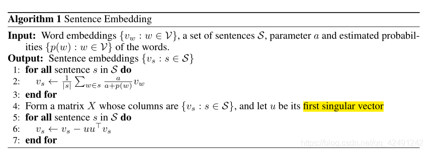

1. 首先对sentence进行分词，利用预训练语言模型获取每一个word的词向量$v_w$;

2. 对$v_w$进行加权平均得到初始句向量$v_s$：
   $$
   v_s=\frac{1}{|s|}\sum_{w\in s}\frac{\alpha}{\alpha + p(w)}v_w
   $$
   式中，$\alpha$为常数，$p(w)$为word w的概率（频率），$|s|$为句子s的长度;

3. 利用PCA/SVD等方法进行主成分分析，得到最大特征值对应的特征向量（第一主成分）u，计算投影矩阵$uu^T$

4. 将初始句向量矩阵$V_s \in \R^{s\times n}$（s为embedding的size，n为corpus的size）减去其在第一主成分上的投影，得到最终的句向量矩阵：
   $$
   V_s=V_s-uu^TVs
   $$
   减去主成分可以有效降低句向量之间的耦合性，增强鲁棒性。

   reference：https://blog.csdn.net/qq_42491242/article/details/105381771

代码：

```python
class SIFRetrievalModel:
    """
    A simple but tough-to-beat baseline for sentence embedding.
    from https://openreview.net/pdf?id=SyK00v5xx
    Principle : Represent the sentence by a weighted average of the word vectors, and then modify them using Principal Component Analysis.

    Issue 1: how to deal with big input size ?
    randomized SVD version will not be affected by scale of input, see https://github.com/PrincetonML/SIF/issues/4

    Issue 2: how to preprocess input data ?
    Even if you dont remove stop words SIF will take care, but its generally better to clean the data,
    see https://github.com/PrincetonML/SIF/issues/23

    Issue 3: how to obtain the embedding of new sentence ?
    Weighted average is enough, see https://www.quora.com/What-are-some-interesting-techniques-for-learning-sentence-embeddings
    """

    def __init__(self, corpus, pretrained_embedding_file, cached_embedding_file, embedding_dim):

        self.embedding_dim = embedding_dim
        self.max_seq_len = 0
        corpus_str = []
        for line in corpus:
            corpus_str.append(' '.join(line))
            self.max_seq_len = max(self.max_seq_len, len(line))
        # 计算词频
        counter = CountVectorizer(token_pattern=r"(?u)\b\w+\b")
        # bag of words format, i.e., [[1.0, 2.0, ...], []]
        bow = counter.fit_transform(corpus_str).todense().astype('float')
        # word count
        word_count = np.sum(bow, axis=0) # 每一个单词出现的次数，维度为总词数
        # word frequency, i.e., p(w)
        word_freq = word_count / np.sum(word_count) # 计算每个单词的词频

        # the parameter in the SIF weighting scheme, usually in the range [1e-5, 1e-3]
        SIF_weight = 1e-3
        # 计算词权重
        self.word2weight = np.asarray(SIF_weight / (SIF_weight + word_freq))  #  alpha / （alpha + pw）

        # number of principal components to remove in SIF weighting scheme
        self.SIF_npc = 1
        self.word2id = counter.vocabulary_

        # 语料 word id
        seq_matrix_id = np.zeros((len(corpus_str), self.max_seq_len), dtype=np.int64)
        # 语料 word 权重
        seq_matrix_weight = np.zeros((len(corpus_str), self.max_seq_len), dtype=np.float64)

        # 依次遍历每个样本
        for idx, seq in enumerate(corpus):
            seq_id = []
            for word in seq:
                if word in self.word2id:
                    seq_id.append(self.word2id[word])

            seq_len = len(seq_id)
            seq_matrix_id[idx, :seq_len] = seq_id

            seq_weight = [self.word2weight[0][id] for id in seq_id]
            seq_matrix_weight[idx, :seq_len] = seq_weight

        if os.path.exists(cached_embedding_file):
            self.word_embeddings = load_embedding(cached_embedding_file)
        else:
            self.word_embeddings = get_word_embedding_matrix(counter.vocabulary_, pretrained_embedding_file, embedding_dim=self.embedding_dim)
            save_embedding(self.word_embeddings, cached_embedding_file)

        # 计算句向量
        self.sentence_embeddings = self.SIF_embedding(seq_matrix_id, seq_matrix_weight)

        # build search model
        self.t = AnnoyIndex(self.embedding_dim)
        for i in range(self.sentence_embeddings.shape[0]):
            self.t.add_item(i, self.sentence_embeddings[i, :])
        self.t.build(10)

    def SIF_embedding(self, x, w):
        """句向量计算"""
        # weighted averages
        n_samples = x.shape[0]
        emb = np.zeros((n_samples, self.word_embeddings.shape[1]))
        for i in range(n_samples):
            emb[i, :] = w[i, :].dot(self.word_embeddings[x[i, :], :]) / np.count_nonzero(w[i, :])

        # removing the projection on the first principal component
        # randomized SVD version will not be affected by scale of input, see https://github.com/PrincetonML/SIF/issues/4
        #svd = TruncatedSVD(n_components=self.SIF_npc, n_iter=7, random_state=0)
        svd = PCA(n_components=self.SIF_npc, svd_solver='randomized')
        svd.fit(emb)
        self.pc = svd.components_
        #print('pc shape:', pc.shape)

        if self.SIF_npc == 1:
            # pc.transpose().shape : embedding_size * 1
            # emb.dot(pc.transpose()).shape: num_sample * 1
            # (emb.dot(pc.transpose()) * pc).shape: num_sample * embedding_size
            common_component_removal = emb - emb.dot(self.pc.transpose()) * self.pc
        else:
            # pc.shape: self.SIF_npc * embedding_size
            # emb.dot(pc.transpose()).shape: num_sample * self.SIF_npc
            # emb.dot(pc.transpose()).dot(pc).shape: num_sample * embedding_size
            common_component_removal = emb - emb.dot(self.pc.transpose()).dot(self.pc)
        return common_component_removal

    def get_top_similarities(self, query, topk=10):
        """query: [word1, word2, ..., wordn]"""
        query2id = []
        for word in query:
            if word in self.word2id:
                query2id.append(self.word2id[word])
        query2id = np.array(query2id)

        id2weight = np.array([self.word2weight[0][id] for id in query2id])

        query_embedding = id2weight.dot(self.word_embeddings[query2id, :]) / query2id.shape[0]
        top_ids, top_distances = self.t.get_nns_by_vector(query_embedding, n=topk, include_distances=True)
        return top_ids

```

**小结**：

BM25算法是从字符级别出发，利用词语权重直接计算query和doc的相似度，相似度排序后取topk结果；而SIF是从语义向量的角度出发，将query和doc均表征成句向量，后续可以利用Annoy等方法召回，或者数据量不大的情况下计算向量间的相似性。具体什么时候使用哪种算法，需要结合具体场景进行分析，在没有比较好的语义向量的情况下，使用BM25方法一般要优于基于向量的方法。

### WAND

WAND(weak and)是一种搜索算法，应用在query有较多关键词或标签，同时每个document也有多个关键词或标签的场景，使用Wand能够高效地召回出TopK个相关的document，算法的原始论文见 [Efficient Query Evaluation using a Two-Level Retrieval Process](http://7viirv.com1.z0.glb.clouddn.com/4331f68fcd_wand.pdf)，这里根据自己的理解简单地总结一些Wand算法的原理。

一般来说，检索会用到倒排索引，根据query可以筛选出每一个item所对应的document list，但是当候选文档集合比较大时，遍历整个list所需要的开销也表较大。Wand的做法就是在筛选TopK个候选文档时，跳过一些与query相关性比较低的document，从而极大加速检索过程。

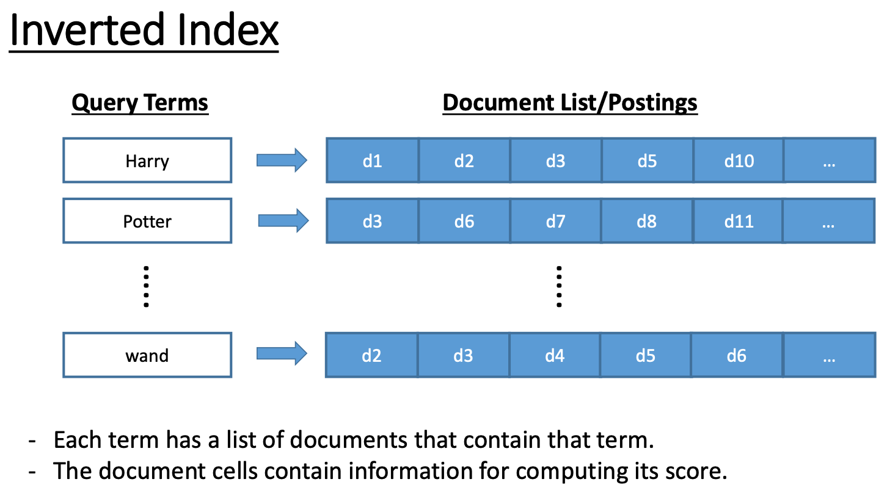

Wand算法的核心思想可以概括为：**Wand 算法通过计算每个词的贡献上限来估计文档的相关性上限，并与预设的阈值比较，进而跳过一些相关性一定达不到要求的文档，从而得到提速的效果。**

Wand算法首先估计query中的**每个词对文档相关性贡献的上限（upper bound）**，这里的相关性一般直接取单词的TF-IDF值，因为对于一个单词来说，当整个文档库确定下来之后，单词的IDF是固定不变的，但是TF值在不同文档中是不一样的，因此只需要估计一个词在各个文档中的词频TF上限(即这个词在各个文档中最大的TF)，该步骤通过线下计算即可完成。

线下计算出各个词的相关性上限，可以计算出**一个 query 和一个文档的相关性上限值**，就是他们共同出现的词的相关性上限值的和，通过与预设的阈值比较，如果query 与文档的相关性大于阈值，则进行下一步的计算，否则丢弃。

具体而言，在document level上来说，每一个文档我们需要记录其ID（DID），并且需要按照从小到大排序，同时需要计算query每一个item在该文档中的词频Term Frequency；在query term level上来说，需要记录其term ID，逆文档频率（IDF），并估计其在对应的候选文档列表中的相关性上限值（upper bound），这个上限值一般取TF-IDF的最大值，计算公式：

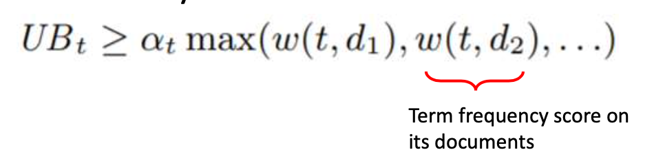

这里的$a_t$是query中第t个term的IDF。那么，对于document d和query q来说，其相关性上限d与q共同出现的单词的相关性上限值和：

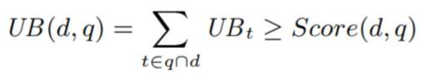

举个例子：

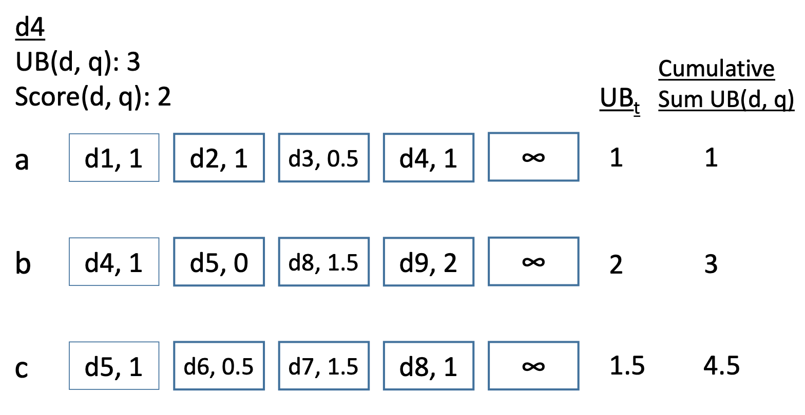

图中，query包括a，b，c三个单词，其DID均从小到大排列，不难看出，a，b，c的ub分别等于1，2，1.5，对于document d4来说，出现的单词有a和b，

那么其相关性上限为a的相关性上限与b的相关性上限之和，即3，同时，因为每个term对于每个文档的TF-IDF是线下计算的，因此可以计算出query对于d4的实际score为2。

总结一下，Wand算法步骤如下：

1. 建立倒排索引，记录每个单词所在的所有文档ID（DID），并按照从小到大排序；
2. 初始化 posting 数组，使得 posting[pTerm] 为词 pTerm 倒排索引中第一个文档的 index；
3. 初始化 curDoc = 0（文档ID从1开始）

接着执行如下过程：

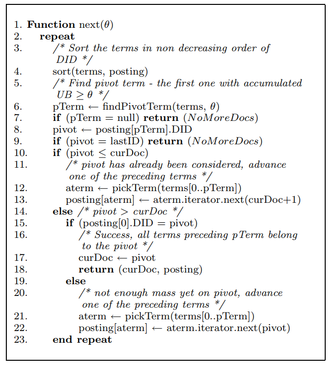


这里以一个例子解释一下上面的计算过程（top1）：

1. 首先建立好倒排索引，DID按照从小到大排序，计算每一个item的相关性上限，初始化阈值为0，如下图所示

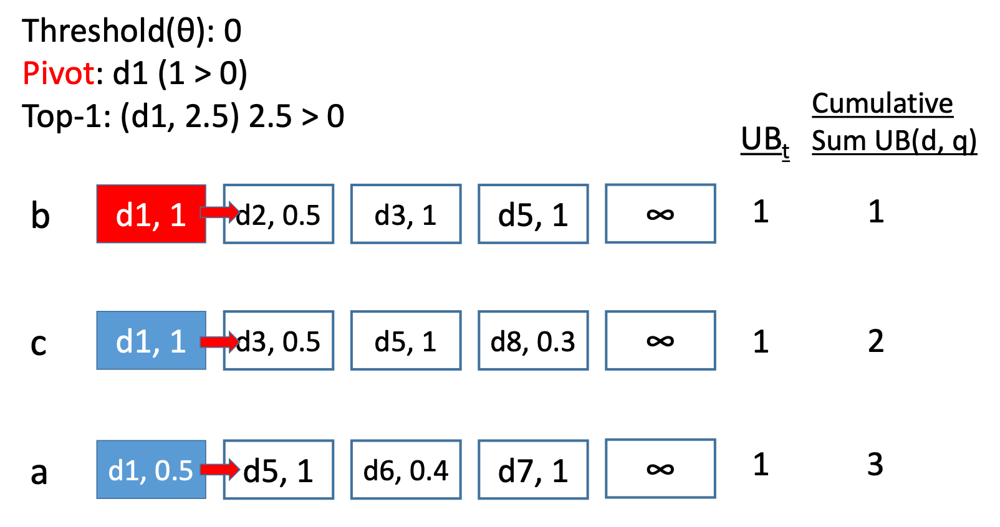

2. 对于每一个item，初始化指针指向最小的DID d1，其score为2.5>0，因此，d1会作为pivot，并更新阈值为2.5；

3. 接着，更新指针的位置，对于d2来说，只出现了b这一个单词，其ub=1<2.5，skip，然后b的指针更新到d3；对于d3来说，出现了b和c两个单词，其相关性上限为2<2.5，skip，b和c的指针均更新到d5；对于d5来说，出现了b，c和a三个单词，其ub=3>2.5，因此需要计算其实际score=3，然后更新pivot，并分别更新相应指针。

   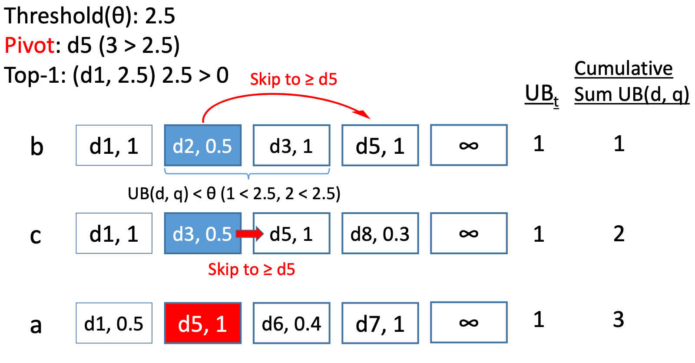

4. 更新top-1；


5. 更新阈值；

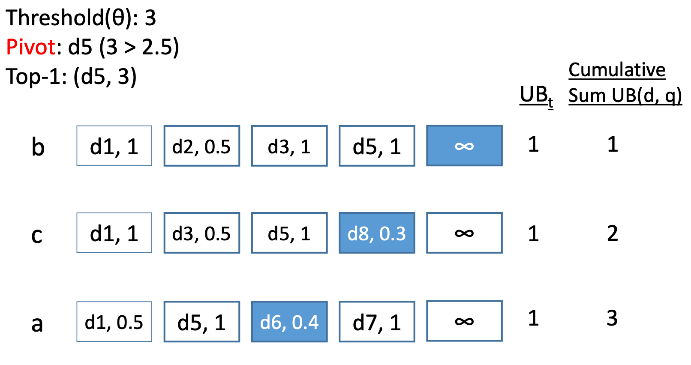

6. 接着遍历后面的文档，但是这个例子中发现，b的文档已经更新结束，对于c和a而言，其相关性上限最大值为2<3，因此也就无需再进行遍历，全部跳过。

这个过程就演示了WAND算法的计算原理。

## **信息检索召回**(近邻搜索方法)

### 一、Annoy

[Annoy(Approximate Nearest Neighbors on Yeah)](https://github.com/spotify/annoy)是Spotify开源的海量场景下从高维空间求近似最近邻的库，Spotify中用来进行音乐推荐。检索场景下用于粗排（召回），快速从海量数据中找到一小部分与query相似的样本，然后做ranking。

Annoy的基本思想是通过随机构建超平面，将海量数据建立成一颗二叉树，每个数据的查找时间复杂度为O(logN)。为了使得结果更加准确，可借鉴random forest的思想，随机生成多颗二叉树，然后求并集，在并集的基础上做ranking。

Annoy的步骤：

1. 建立Annoy index，其实就是不断迭代随机生成超平面的过程，直到每一个叶子结点包含样本的个数满足最大限制；

   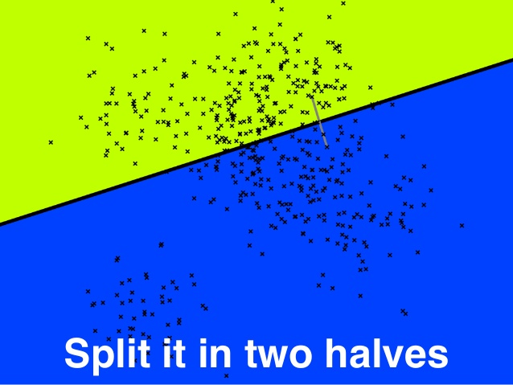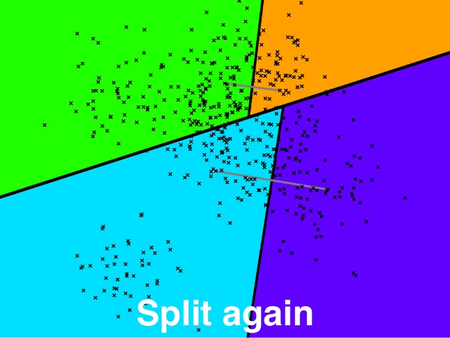

   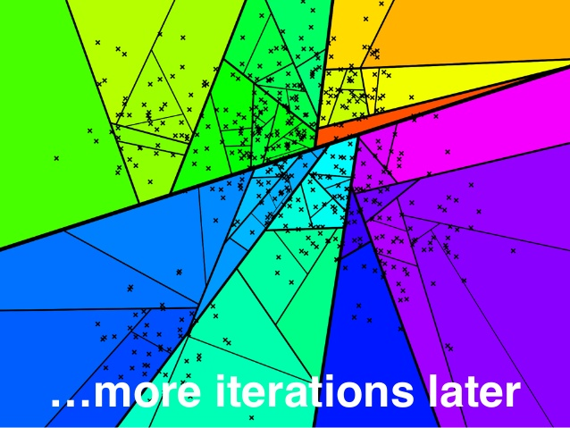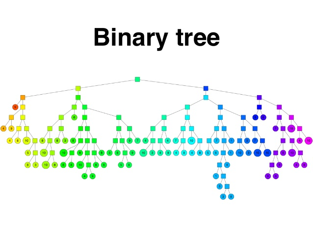

2. search，搜索，从二叉树中进行搜索，时间复杂度为O(logN)，

   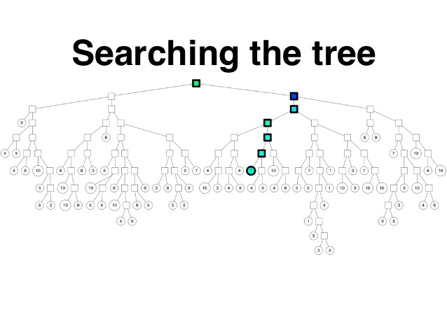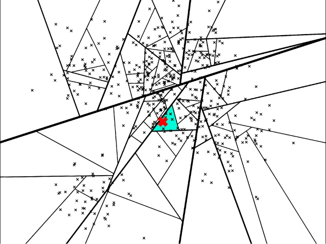


**problem**：

1. 有可能两个最近邻的样本被划分到了两个区域；
2. 同一个区域中的样本不是最近邻的；

**解决办法**：**search both sides  of the split**

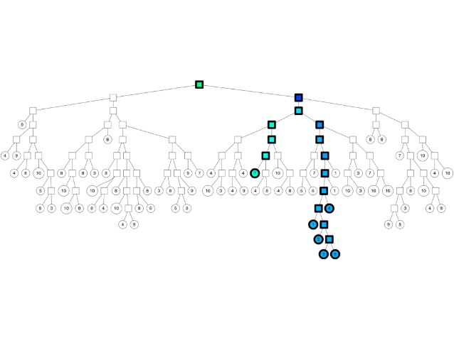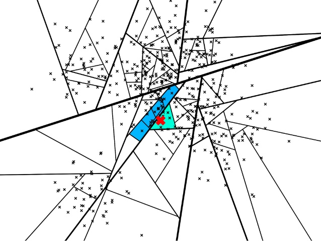

**两个tricks**：

1. 优先队列
2. 随机构建多棵树，然后union，计算相似性返回最近邻结果

代码示例：

```python
from annoy import AnnoyIndex
import random

f = 40
t = AnnoyIndex(f, 'angular')  # Length of item vector that will be indexed
for i in range(1000):
    v = [random.gauss(0, 1) for z in range(f)]
    t.add_item(i, v)

t.build(10) # 10 trees
t.save('test.ann')

# ...

u = AnnoyIndex(f, 'angular')
u.load('test.ann') # super fast, will just mmap the file
print(u.get_nns_by_item(0, 1000)) # will find the 1000 nearest neighbors
```

### 二、HNSW

HNSW（Hierarchcal Navigable Small Graph Vectors）是一种利用图来计算高维空间近似最近邻的搜索方法，[一文看懂HNSW算法理论的来龙去脉](https://blog.csdn.net/u011233351/article/details/85116719)介绍得很好，值得一读。这里总结一下HNSW算法的基本原理。

HNSW算法是一步一步发展起来的，其理论经过了朴素思想到NSW，再到HNSW的发展变化，我们先来了解一下朴素思想。

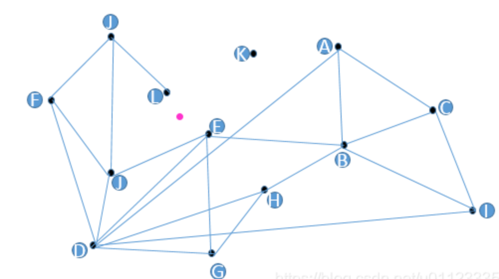

假如，某一个高维空间中存在这一些节点，如上图所示，节点用黑色实点表示，节点与节点之间用实线连接，构成查找图。查找图中与某一个节点相连的节点称为该节点的友节点。

现在来看搜索过程，假如现在的目标是检索与图中粉色点最近的节点，一个朴素的思想是，**先任意从查找图中某一个节点出发，计算其与目标节点的距离，并计算该节点的友节点与目标节点的距离，如果存在距离更小的友节点，则遍历到该友节点，重复这一过程，直至某一个节点到目标节点的距离小于其所有友节点到目标节点的距离（找到了与目标节点距离最近的节点），这一个点就是我们寻找的近似最近邻。**

这一搜索过程存在很明显的缺陷：

* 搜索是随机初始化的，如果初始化没有到图中的K点，那么K点将永远不会被搜索到；如果初始化到一个距离非常远的点，搜索过程需要跳转多次才能找到最近邻。
* 如果要寻找粉色点的最近的两个点，如果两个点之间没有连线，那么搜索的效率将非常低下。
* D点友节点过多，需要进行裁剪

在朴素思想的基础上，提出了三点规定：

1. 在构建查找图时，所有节点都必须具有K个友节点；
2. 所有距离相近（相似）到一定程度的向量必须互为友点。
3. 图中所有连接（线段）的数量最少。

这一算法就是图论中的德劳内（Delaunay）三角剖分算法，如下图所示。


但是，德劳内算法构图的时候对于每一个节点需要和所有节点进行计算才能得到友节点，因此构图时间复杂度较高，并且如果初始点和查找点距离很远的话我们需要进行多次跳转才能查到其临近，因此也没有很好的查找效率。

#### NSW算法

在此基础上，**NSW算法**（**Navigable Small World**）提出了“高速公路”机制（Expressway mechanism, 这里指部分远点之间拥有线段连接，以便于快速查找）。如下：

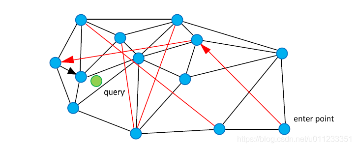

图中黑色连线是友节点的连线，红色连线就是高速公路了，因此在查找的过程中，我们首先从enter point进入查找图，然后利用高速公路快速找到离目标节点最近的节点，然后再按照上述朴素思想的方法继续寻找，直到满足条件。

查找过程比较简单易懂，关键就在于构图过程，具体看一下是怎么生成高速公路的。

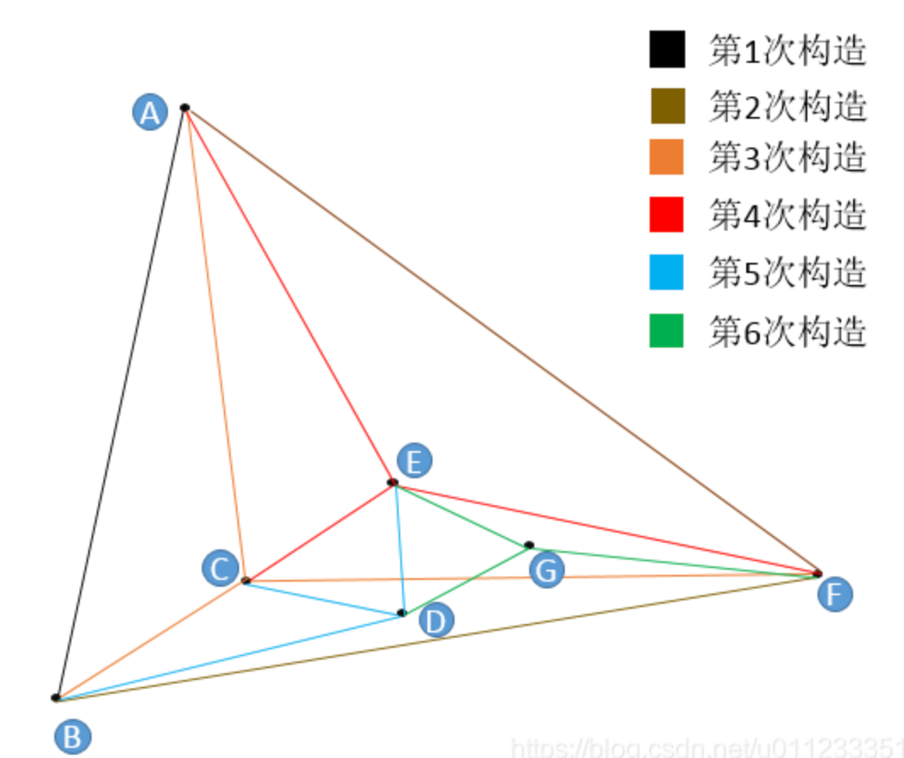

NSW算法的构图过程抛弃了德劳内三角构图法，改为朴素插入法，节点的友节点在插入的过程中会不断更新，这就大大提高了构图效率，如上图所示，假如我们现在有待插的ABCDEFG7个节点，设定友节点个数m=3， 构图过程如下：

* 插入A点，此时图中没有其他节点

* 插入B点，此时图中只有A一个节点，所以A一定是B的友节点，连接BA；

* 插入F点，同理，连接FA，FB；

* 插入C点，连接CA、CB、CF；

  至此，每一个节点都满足了NSW算法构图的规定，接下来的过程比较重要：

* 插入E点，此时图中已经有了ABCF三个节点，所以这里用朴素查找的方法，首先随机进入一个点，假如进入A点，计算A点及其友节点与E点的距离，然后选择距离最近的点，作为下一个进入的点，如果这个点就是A点，如果E的友节点数不够m，则寻找下一个更近的点，直到找到最近的三个点，依次添加为E的友节点
* 插入D、G点，过程如E

注意：

1. 越早插入的点越有可能构成“高速公路”，假设我们现在要构成10000个点组成的图，设置m=4（每个点至少有4个“友点”），这10000个点中有两个点，p和q，他们俩坐标完全一样。假设在插入过程中我们分别在第10次插入p，在第9999次插入q，第10次插入时，只见过前9个点，故只能在前9个点中选出距离最近的4个点（m=4）作为“友点”，而q的选择就多了，前9998个点都能选，所以q的“友点”更接近q，p的早期“友点”不一定接近p，所以p更容易具有“高速公路”。结论：**一个点，越早插入就越容易形成与之相关的“高速公路”连接，越晚插入就越难形成与之相关的“高速公路”连接。**
2. 在查找的过程中，为了提高效率，我们可以建立一个废弃列表，在一次查找任务中遍历过的点不再遍历。在一次查找中，已经计算过这个点的所有友点距离查找点的距离，并且已经知道正确的跳转方向了，这些结果是唯一的，没有必要再去做走这个路径，因为这个路径会带给我们同样的重复结果，没有意义。
3. 在查找过程中，为了提高准确度，我们可以建立一个动态列表，把距离查找点最近的n个点存储在表中，并行地对这n个点进行同时计算“友点”和待查找点的距离，在这些“友点”中选择n个点与动态列中的n个点进行并集操作，在并集中选出n个最近的友点，更新动态列表。

以下给出**NSW算法查询**的过程：

1. 首先建立三个集合：candidates、visited和results；
2. 随机选择一个点作为entry_point，把该点加入candidates和visited中；
3. 遍历candidates（candidates不为空），从中选择距离查询点q最近的点c，并和results中距离查询点q最远的点d进行比较，如果c和查询点q的距离大于d和查询点q的距离，则说明当前图中所有距离查询点最近的点已经找到了，结束查询；
4. 从candidates中删除点c，如果candidates为空，结束查询；
5. 查询c的所有邻居e，如果e已经在visited中，则跳过，不存在则加入visited；
6. 把比d和q距离更近的e加入到candidates和results中，如果results已满，则删除results中距离点q最远的点d；
7. 循环上述3-6；

伪代码：

```python
K-NNSearch(object q, integer: m, k)
TreeSet [object] tempRes, candidates, visitedSet, result 
// 进行m次循环，避免随机性
for (i←0; i < m; i++) do:
    put random entry point in candidates
    tempRes←null
    repeat:
        // 利用上述提到的贪婪搜索算法找到距离q最近的点c
        get element c closest from candidates to q
        remove c from candidates
        // 判断结束条件 
        if c is further than k-th element from result then
            break repeat
        // 更新后选择列表
        for every element e from friends of c do:
            if e is not in visitedSet then
                add e to visitedSet, candidates, tempRes
    end repeat
    // 汇总结果
    add objects from tempRes to result 
end for 
return best k elements from result
```

#### Skip List

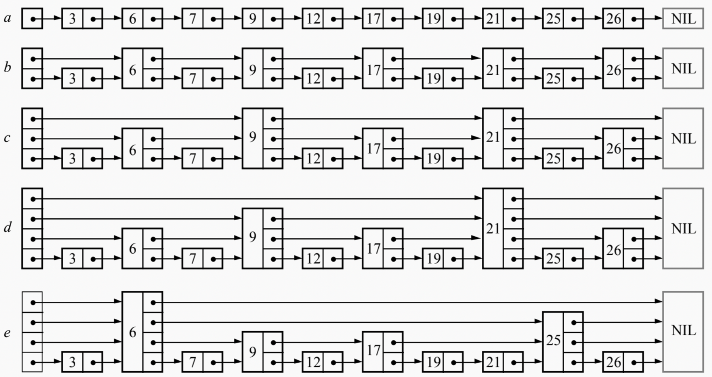


Skip list是一个“概率型”的数据结构，可以在很多场景中替代平衡树。skip list与平衡树相比，有相似的渐进期望时间边界，但是它可以更简单、更快，使用更少的空间；Skip list是一个分层结构多级链表，最下层的是原始链表，每个层级都是下一个层级的“高速跑道”。

* 一个跳跃表由若干个层（level）链表组成；
* 跳跃表中最底层的链表包含所有的数据，每一层链表中的数据都是有序的；
* 如果一个元素x出现在了第i层，那么第0到i-1层均包含了这个元素x；
* 第i层的元素通过一个指针指向下一层拥有相同值的元素；
* 在每一层中，-∞和+∞两个元素都出现，分别表示INT_MIN和INT_MAX；
* 头指针指向最高一层的第一个元素。


#### HNSW

借鉴Skip list的思想，在NSW的基础上增加跳表机制，就形成了查找效率更高的HNSW算法，全称是Hierarchical Navigable Small World，分层的可导航的小世界。

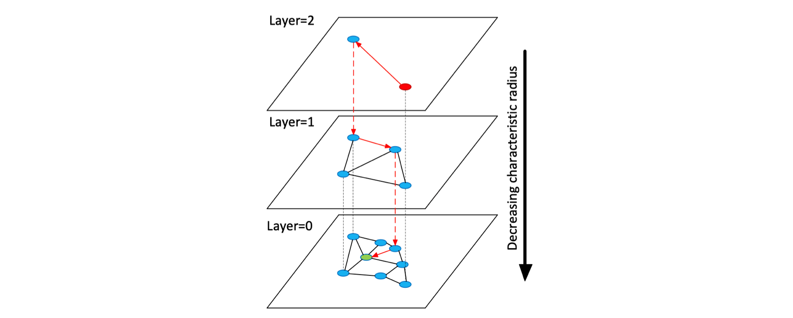

HNSW的思想是依据连接的长度（距离）将连接划分成不同的层，然后就可以在不同层中进行搜索。在这种结构中，搜索从较长的连接（最高层）开始，贪婪地遍历所有元素达到局部最小值，之后再切换到较短的连接（下层），重复该过程，直到找到最近邻的点。

注意：

* 第0层（最下层）中包含所有的节点；
* 最下层向上节点数依次减少，遵循指数衰减规律；
* 建图时新加入的点由指数衰减函数得出该点最高投影到第几层；
* 从最高的投影层向下的层中均包含该点；
* 搜索时从上往下依次查询

##### **查询**

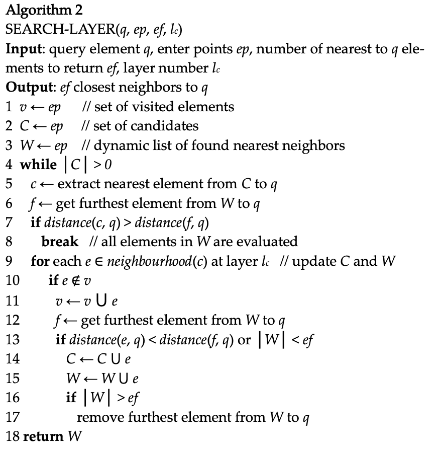

​																							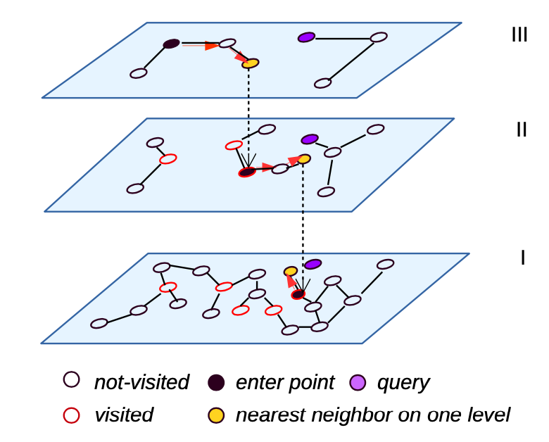	

具体过程如下：

1. 首先把enter points *ep*（图中的黑点）加入到visited *v*，candidates *C*和动态列表*W*中；
2. 在C中查找与查询q最近的点c，在W中查找与q最远的点f，如果distance(c, q) > distance(f, q)，那么说明距离q最近的点已经找到了，结束查询；
3. 在当前层中查询c的所有邻居e（友节点），如果e在v中出现，则跳过，否则，更新v；
4. 如果distance(e, q) < distance(f, q)并且W未满，则将e加入到C和W中；如果W已经满了，则弹出W中距离q最远的元素；
5. 重复2-4，直至满足条件。

这里的每一层的查询算法和上述NSW算法的查询过程一致，实际上HNSW的每一层均是NSW。

##### **构图**

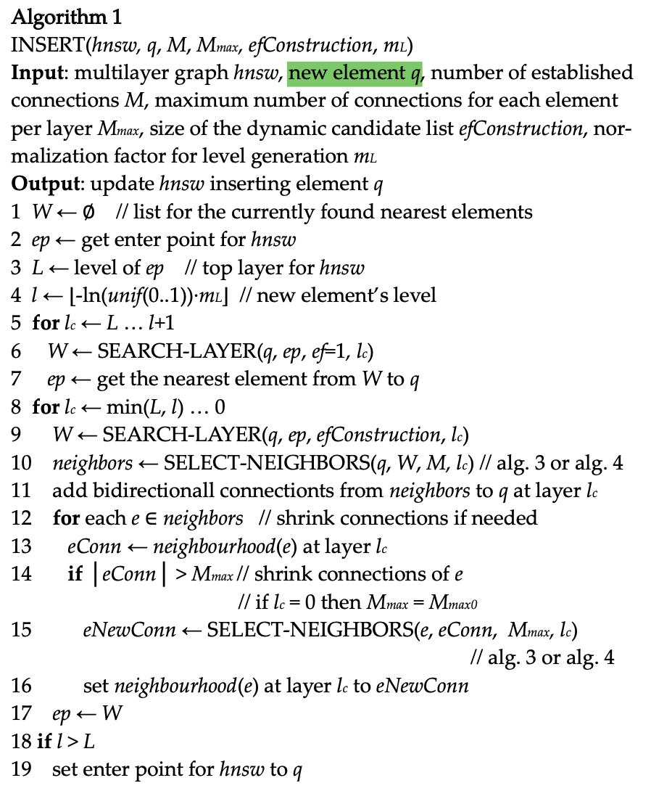

```python
INSERT(hnsw, q, M, Mmax, efConstruction, mL)
/**
 * 输入
 * hnsw：q插入的目标图
 * q：插入的新元素
 * M：每个点需要与图中其他的点建立的连接数
 * Mmax：最大的连接数，超过则需要进行缩减（shrink）
 * efConstruction：动态候选元素集合大小
 * mL：选择q的层数时用到的标准化因子
 */
Input: 
multilayer graph hnsw, 
new element q, 
number of established connections M, 
maximum number of connections for each element per layer Mmax, 
size of the dynamic candidate list efConstruction, 
normalization factor for level generation mL
/**
 * 输出：新的hnsw图
 */
Output: update hnsw inserting element q

W ← ∅  // W：现在发现的最近邻元素集合
ep ← get enter point for hnsw
L ← level of ep
/**
 * unif(0..1)是取0到1之中的随机数
 * 根据mL获取新元素q的层数l
 */
l ← ⌊-ln(unif(0..1))∙mL⌋
/**
 * 自顶层向q的层数l逼近搜索，一直到l+1,每层寻找当前层q最近邻的1个点
 * 找到所有层中最近的一个点作为q插入到l层的入口点
 */
for lc ← L … l+1
    W ← SEARCH_LAYER(q, ep, ef=1, lc)
    ep ← get the nearest element from W to q
// 自l层向底层逼近搜索,每层寻找当前层q最近邻的efConstruction个点赋值到集合W
for lc ← min(L, l) … 0
    W ← SEARCH_LAYER(q, ep, efConstruction, lc)
    // 在W中选择q最近邻的M个点作为neighbors双向连接起来
    neighbors ← SELECT_NEIGHBORS(q, W, M, lc)
    add bidirectional connectionts from neighbors to q at layer lc
    // 检查每个neighbors的连接数，如果大于Mmax，则需要缩减连接到最近邻的Mmax个
    for each e ∈ neighbors
        eConn ← neighbourhood(e) at layer lc
        if │eConn│ > Mmax
            eNewConn ← SELECT_NEIGHBORS(e, eConn, Mmax, lc)
            set neighbourhood(e) at layer lc to eNewConn
    ep ← W
if l > L
    set enter point for hnsw to q
```

输入：graph ，q是待插入点，Mmax是每个点在某一层最多的连接数

输出：插入q，更新hnsw

具体过程如下：

1-4). 第0阶段：初始化W，ep，L，并根据公式计算待插入的元素的最大层l（$m_L$是一个正则化参数）；

5-7). 第1阶段：从最高层L往下直到待插入元素的最大层的上一层l+1，贪婪搜索待插入点q的最近邻的点ep，当前层的最近邻作为下一层的ep；

> The first phase of the insertion process starts from the top layer by greedily traversing the graph in order to find the ef closest neighbors to the inserted element q in the layer. After that, the algorithm continues the search from the next layer using the found closest neighbors from the previous layer as enter points, and the process repeats

8-17). 第2阶段：设置*efConstruction*控制每一层的最近邻的数量，从待插入元素的最大层开始一直到第0层，把第一阶段中获取的近邻值ep作为当前层的enter point，并用上面提到的SEARCH-LAYER依次在每一层查找最近邻（最近邻数量为*efConstruction*，为了保证检索召回率，注意第一阶段该值为1），搜索到的最近邻会通过SELECT-NEIGHBOURS选取前几个到neighbors中，然后在当前层中添加neighbors到q之间的双向连接，并判断neighbor e的连接数是否超过了最大限制$M_{max}$，如果超过了限制，则需要对e的连接进行更新，最后把搜索到的最近邻作为下一次的enter points。

#####  检索

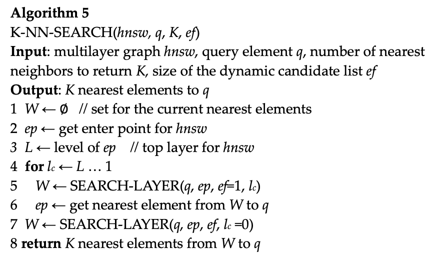

检索的过程就易懂了，首先传入构建好的图hnsw，待查询的元素q，需要返回的最近邻的数量K和动态候选list的大小*ef*，然后从最高层开始，逐层往下依次寻找每一层的最近邻作为下一层的enter point，最后在第0层查询topk的最近邻元素，并返回。

### 三、KD Tree

KD树（K-Dimensional 树的简称），是一种分割k维数据空间的数据结构。主要应用于多维空间关键数据的搜索（如：范围搜索和最近邻搜索）。

[详解KDTree_爱冒险的技术宅-CSDN博客_kdtree](https://blog.csdn.net/silangquan/article/details/41483689)


## **Faiss**

[Faiss](https://github.com/facebookresearch/faiss/wiki)，全称Facebook AI Similarity Search，是Facebook开源的用于进行快速文档搜索的库。Faiss利用十亿规模的数据集构建了最邻近搜索实现，这些实现比以前报道的最新技术快了8.5倍，并结合了文献中已知的最快的GPU上的k选择算法。Faiss也是10亿个高维向量上建立了第一个k最近邻图。

整体来说，Faiss的使用方式可以分为三个步骤：

1. 构建训练数据以矩阵的形式表示，比如我们现在经常使用的embedding，embedding出来的向量就是矩阵的一行。
2. 为数据集选择合适的index，index是整个Faiss的核心部分，将第一步得到的训练数据add到index当中。
3. search，或者说query，搜索到最终结果。

Faiss的主要功能是对向量进行相似搜索。具体就是给定一个向量，在所有已知的向量库中找出与其相似度最高的一些向量，本质是一个KNN(K近邻)问题，比如google的以图找图功能。随着目前embedding的流行，word2vec,doc2vec,img2vec,item2vec,video2vec,everything2vec，所以faiss也越来越受到大家的欢迎。
根据上面的描述不难看出，faiss本质是一个向量(矢量)数据库，这个数据库在进行向量查询的时候有其独到之处，因此速度比较快，同时占用的空间也比较小。

|                          Method                          |        Class name         |     `index_factory`      |                       Main parameters                        |                    Bytes/vector                     | Exhaustive |                           Comments                           |
| :------------------------------------------------------: | :-----------------------: | :----------------------: | :----------------------------------------------------------: | :-------------------------------------------------: | :--------: | :----------------------------------------------------------: |
|                   Exact Search for L2                    |       `IndexFlatL2`       |         `"Flat"`         |                             `d`                              |                        `4*d`                        |    yes     |                         brute-force                          |
|              Exact Search for Inner Product              |       `IndexFlatIP`       |         `"Flat"`         |                             `d`                              |                        `4*d`                        |    yes     |        also for cosine (normalize vectors beforehand)        |
|   Hierarchical Navigable Small World graph exploration   |      `IndexHNSWFlat`      |       'HNSWx,Flat`       |                           `d`, `M`                           |                `4*d + x * M * 2 * 4`                |     no     |                                                              |
|        Inverted file with exact post-verification        |      `IndexIVFFlat`       |      `"IVFx,Flat"`       |             `quantizer`, `d`, `nlists`, `metric`             |                      `4*d + 8`                      |     no     | Takes another index to assign vectors to inverted lists. The 8 additional bytes are the vector id that needs to be stored. |
|      Locality-Sensitive Hashing (binary flat index)      |        `IndexLSH`         |            -             |                         `d`, `nbits`                         |                   `ceil(nbits/8)`                   |    yes     | optimized by using random rotation instead of random projections |
|            Scalar quantizer (SQ) in flat mode            |  `IndexScalarQuantizer`   |         `"SQ8"`          |                             `d`                              |                         `d`                         |    yes     |       4 and 6 bits per component are also implemented.       |
|           Product quantizer (PQ) in flat mode            |         `IndexPQ`         | `"PQx"`, `"PQ"x"x"nbits` |                      `d`, `M`, `nbits`                       |                `ceil(M * nbit / 8)`                 |    yes     |                                                              |
|                 IVF and scalar quantizer                 | `IndexIVFScalarQuantizer` |  "IVFx,SQ4" "IVFx,SQ8"   |             `quantizer`, `d`, `nlists`, `qtype`              | SQfp16: 2 * `d` + 8, SQ8: `d` + 8 or SQ4: `d/2` + 8 |     no     |              Same as the `IndexScalarQuantizer`              |
|        IVFADC (coarse quantizer+PQ on residuals)         |       `IndexIVFPQ`        |   `"IVFx,PQ"y"x"nbits`   |           `quantizer`, `d`, `nlists`, `M`, `nbits`           |                `ceil(M * nbits/8)+8`                |     no     |                                                              |
| IVFADC+R (same as IVFADC with re-ranking based on codes) |       `IndexIVFPQR`       |      `"IVFx,PQy+z"`      | `quantizer`, `d`, `nlists`, `M`, `nbits`, `M_refine`, `nbits_refine` |                   `M+M_refine+8`                    |     no     |                                                              |

具体每一种index的介绍见[Faiss indexes · facebookresearch/faiss Wiki (github.com)](https://github.com/facebookresearch/faiss/wiki/Faiss-indexes)

tutorials：[Getting started · facebookresearch/faiss Wiki (github.com)](https://github.com/facebookresearch/faiss/wiki/Getting-started)


参考：

[近似最近邻算法 HNSW 学习笔记（二） 主要算法伪代码分析 | Ryan Li God](https://www.ryanligod.com/2018/11/29/2018-11-29 HNSW 主要算法/)


