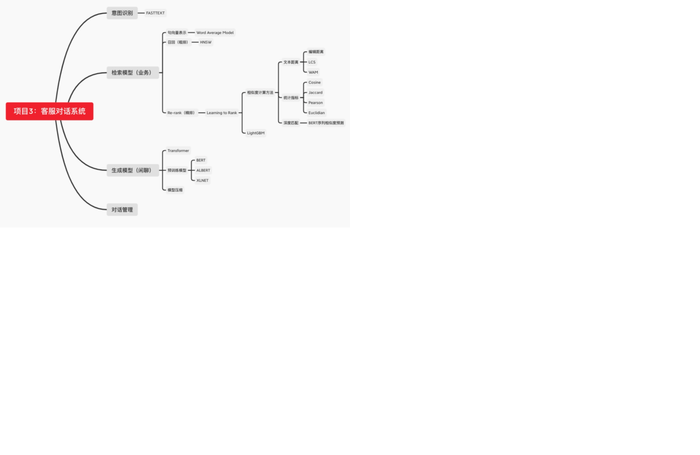
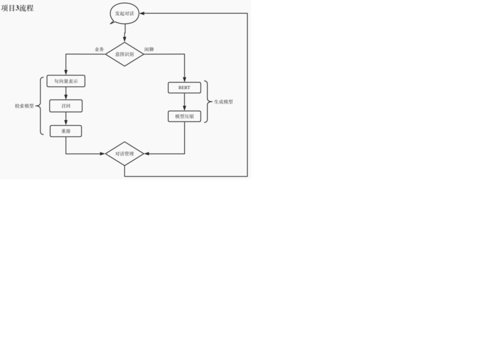
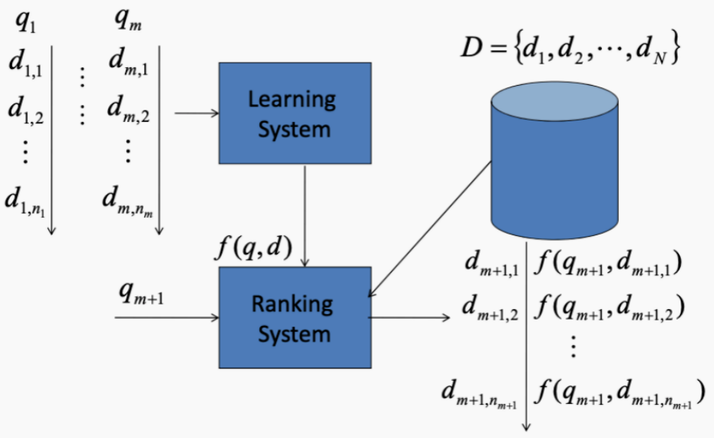

# 京东客服对话系统实战

[TOC]


## **项目介绍**


## **整体框架**





## **数据预处理**

### 训练数据：

* chat.txt：

```
会话编号 顾客id sku 是否客服发送 是否转出 是否重复咨询 内容
000002d0fa6d23510c40200e45ce293c        USERID_10503190 0       0       0               这款电脑能用不
000002d0fa6d23510c40200e45ce293c        USERID_10503190 0       0       0               写的是车载
000002d0fa6d23510c40200e45ce293c        USERID_10503190 1       0       0               小妹正在火速为您查询，还请您稍等一下呢，谢谢#E-s[数字x]
000002d0fa6d23510c40200e45ce293c        USERID_10503190 1       0       0                 亲爱的  还辛苦您先稍等下的哈
000002d0fa6d23510c40200e45ce293c        USERID_10503190 1       0       0               这边咨询下下 供应商的哈
000002d0fa6d23510c40200e45ce293c        USERID_10503190 0       0       0               好的
000002d0fa6d23510c40200e45ce293c        USERID_10503190 1       0       0               #E-s[数字x]#E-s[数字x]
000002d0fa6d23510c40200e45ce293c        USERID_10503190 1       0       0                 亲爱的  感谢您的理解的哈
000002d0fa6d23510c40200e45ce293c        USERID_10503190 1       0       0               请问还有什么需要为您效劳的呢?#E-s[数字x]
000002d0fa6d23510c40200e45ce293c        USERID_10503190 0       0       0               没事
```

* ware.txt

```
sku 品类
10000164        大学英语
10000183        职业/行业英语
1000040105      裤子
10000481        轻工业、手工业
100005  赠品
1000054 U盘
1000055710      狗粮
10000681418     香皂花
10000844021     光学镜架/镜片
```

* order.txt:

```
订单号 userId   sku  品类 订单状态
ORDERID_10115644        USERID_10000003 5912043 手机    4
ORDERID_10181246        USERID_10000005 7333191 手机    4
ORDERID_10494858        USERID_10000007 3527967 行车记录仪      4
ORDERID_10464823        USERID_10000009 5962246 手机    4
ORDERID_10234884        USERID_10000012 5911245 手机    3
ORDERID_10194148        USERID_10000013 7119306 手机    4
ORDERID_10531796        USERID_10000021 6000374 手机    3
ORDERID_10531796        USERID_10000021 5962246 手机    3
```

* 开发集：

```
a_54    customer_aXY    2297112 0       我收到商品不知道怎么使用
a_54    customer_aXY    2297112 1       您好，京东客服4**号很高兴为您服务！<sep>您好，京东客服4**号很高兴为您服务！<sep>NULL
a_54    customer_aXY    2297112 0       我买的数据线充不进去电
a_54    customer_aXY    2297112 1       2297112 品胜（PISEN）苹果数据线 Xs Max/XR/X/8手机充电线 1.2米白色 适用于苹果5/6S/7/8Plus iPad Air/Pro !@@@!外观有破损吗<sep>您好，您收到商品是否有破损呢，使用的时候是否有什么提示呢<sep>NULL
a_54    customer_aXY    2297112 0       没有
a_54    customer_aXY    2297112 1        这边给您申请换货!@@@!您看好吗<sep>这样的话，这边为您申请一下换货您看可以么<sep>NULL
a_54    customer_aXY    2297112 0       好的
a_54    customer_aXY    2297112 0       我现在在学校里，地址有变
a_54    customer_aXY    2297112 1       可以改!@@@!提供一下地址<sep>好的，麻烦您提供一下地址这边为您更新哈<sep>NULL
a_54    customer_aXY    2297112 0       四川省***
```

* 测试集:

```
a_47    customer_9Ta    100000323579    0       怎么申请价保呢？
a_47    customer_9Ta    100000323579    1       您好，京东客服1**号很高兴为您服务！!@@@!有什么问题我可以帮您处理或解决呢？<sep>您好，京东客服1**号很高兴为您服务！!@@@!您看是商品降价的问题么？<sep>您好，京东客服很高兴为您服务！
a_47    customer_9Ta    100000323579    0       你好
a_47    customer_9Ta    100000323579    0       NULL
a_47    customer_9Ta    100000323579    0       要求补差价
a_47    customer_9Ta    100000323579    1       还请您稍等，正在为您查询~!@@@!  尼康（Nikon）D3500 18-55 入门VR防抖套机 单反数码照相机 女神/新手单反 轻巧便携!@@@!您好，请问是这个商品吗？<sep>稍等一下哦，我帮您看看!@@@!您看是这个订单么？订单号：***<sep>现在是商品有降价是吗
a_47    customer_9Ta    100000323579    0       是
a_47    customer_9Ta    100000323579    0       你看下我提交的订单
```

### **数据清洗**

* 使用re模块进行数据清洗，需要清洗的特殊字段有：

  ```
  1. #E-s[数字x] #E-2[数字x] 等一系列数字—— 表情
  2. [ORDERID_10187709] —— 订单号
  3. [数字x] —— 数字
  4. https://item.jd.com/5898522.html —— 网址
  5. [地址x] —— 地址
  6. [链接x] —— 链接
  7. [金额x] —— 金额
  8. [日期x] —— 日期
  9. [时间x] —— 时间
  10. [站点x] —— 站点
  11. [组织机构x] ——组织机构
  12. [电话x] —— 电话
  13. [姓名x] —— 人名
  14. 对于表情，做法是直接删除。其他用希腊符号替换。
  ```

* 将原始数据组织成成问答pair, 或者将一次会话内容合并一起

  ​    例如：

  ```
  before：
  0      0    2297112      custom                                       我收到商品不知道怎么使用
 1      0    2297112  assistance                   您好，京东客服[数字x]**号很高兴为您服务！[SEP]NULL
   2      2    2297112      custom                                        我买的数据线充不进去电
3      2    2297112  assistance  [数字x]PlusiPadAir/Pro!@@@!外观有破损吗[SEP]您好，您收到商品是否...
  after：
0      0    2297112                   您好，京东客服[数字x]**号很高兴为您服务！[SEP]NULL         我收到商品不知道怎么使用
  1      2    2297112  [数字x]PlusiPadAir/Pro!@@@!外观有破损吗[SEP]您好，您收到商品是否...          我买的数据线充不进去电
```

## **意图识别分类**

### fasttext：分本分类

* 意图识别模块：使用fasttext构建文本分类模型，label为{0, 1};

* 原始数据预处理：判断咨询中是否包含业务关键词， 如果包含label为1， 否则为0；并处理成fasttext 需要的数据格式

  * fasttext格式：

    ```
    __label__sauce __label__cheese How much does potato starch affect a cheese sauce recipe?
    __label__food-safety __label__acidity Dangerous pathogens capable of growing in acidic environments
    __label__cast-iron __label__stove How do I cover up the white spots on my cast iron stove?
    __label__restaurant Michelin Three Star Restaurant; but if the chef is not there
    __label__knife-skills __label__dicing Without knife skills, how can I quickly and accurately dice vegetables?
    __label__storage-method __label__equipment __label__bread What's the purpose of a bread box?
    __label__baking __label__food-safety __label__substitutions __label__peanuts how to seperate peanut oil from roasted peanuts at home?
    __label__chocolate American equivalent for British chocolate terms
    __label__baking __label__oven __label__convection Fan bake vs bake
    __label__sauce __label__storage-lifetime __label__acidity __label__mayonnaise Regulation and balancing of readymade packed mayonnaise and other sauces
    ```

  * fasttext文档：https://fasttext.cc/docs/en/supervised-tutorial.html

### **Word2Vec：获取词向量**

* 注意：embeddings以字为粒度

#### Phrases & Phraser：提取n-gram

https://stackoom.com/question/37YLX/%E5%9C%A8word-vec-Gensim%E4%B8%AD%E8%8E%B7%E5%8F%96bigrams%E5%92%8Ctrigrams


#### word average model：提取句向量


## **检索召回**

### **HNSW原理**

 [NLP之对话系统及信息检索技术.md](NLP之对话系统及信息检索技术.md) 

### **Faiss**

[Faiss: A library for efficient similarity search - Facebook Engineering (fb.com)](https://engineering.fb.com/2017/03/29/data-infrastructure/faiss-a-library-for-efficient-similarity-search/)

* 结果：

  对于输入的text，此处示例为“我要转人工”，我们可以召回出topk个相关的咨询，及其对应的assistance。

  ```
  index custom                                assistance  q_distance
    0   135723  我要转人工                 请问您是咨询之前的问题还是有其他的问题需要处理呢?         0.0
    1   719281  我要转人工                                      您好，亲         0.0
    2  1152193  我要转人工                         有什么问题我可以帮您处理或解决呢?         0.0
    3   250885  我要转人工               有什么问题我可以帮您处理或解决呢?[SEP][订单x]         0.0
    4   938589  我要转人工                          您好，请问有什么能帮助您的吗?          0.0
    5   786275  我要转人工                         有什么问题我可以帮您处理或解决呢?         0.0
    6   475937  我要转人工                       亲爱的，小妹在的哦，很高兴为您服务哦。         0.0
    7   765552  我要转人工  亲爱的，小萌妹在的哦，请问您有什么需要帮助的呢~~~[SEP]妹子可以帮您解绑的         0.0
    8  1199267  我要转人工                         有什么问题我可以帮您处理或解决呢?         0.0
    9   346774  我要转人工                  您好[SEP]有什么问题我可以帮您处理或解决呢?         0.0
  ```

## 精排Ranking




### 特征提取

实现人工特征的提取。其中各种特征的定义如下：

* [Edit distance - Wikipedia](https://en.wikipedia.org/wiki/Edit_distance)
* [Longest common subsequence problem - Wikipedia](https://en.wikipedia.org/wiki/Longest_common_subsequence_problem#:~:text=The_longest_common_subsequence_(LCS,(often_just_two_sequences).)
* [Euclidean distance - Wikipedia](https://en.wikipedia.org/wiki/Euclidean_distance#:~:text=In_mathematics,_the_Euclidean_distance,metric_as_the_Pythagorean_metric.)
* [Cosine similarity - Wikipedia](https://en.wikipedia.org/wiki/Cosine_similarity)
* [Jaccard index - Wikipedia](https://en.wikipedia.org/wiki/Jaccard_index)
* [Pearson correlation coefficient - Wikipedia](https://en.wikipedia.org/wiki/Pearson_correlation_coefficient)

### 文本相似度模型

* BM25
* TF-IDF
* word2vec
* FastText
* BERT
* 


[无监督语义相似度哪家强？我们做了个比较全面的评测 - 科学空间|Scientific Spaces (kexue.fm)](https://kexue.fm/archives/8321)


