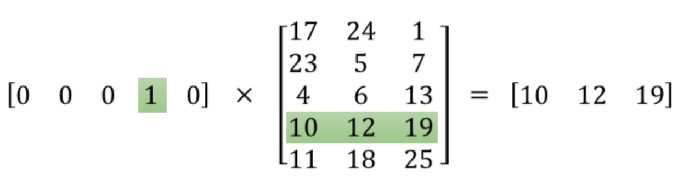

# Word2Vec学习

[TOC]

## 简介

在 NLP 中，把 x 看做一个句子里的一个词语，y 是这个词语的上下文词语，那么这里的 f，便是 NLP 中经常出现的『语言模型』（language model），这个模型的目的，就是判断 (x,y) 这个样本，是否符合自然语言的法则，更通俗点说就是：词语x和词语y放在一起，是不是人话。

Word2vec 正是来源于这个思想，但它的最终目的，不是要把 f 训练得多么完美，而是只关心模型训练完后的副产物——模型参数（这里特指神经网络的权重），并将这些参数，作为输入 x 的某种向量化的表示，这个向量便叫做——词向量。

Word2Vec模型主要有两种：skip-grams(SG) 和 continuous-bag-of-words(CBOW):

* CBOW使用上下文来预测当前的单词
* skip-gram使用当前单词来预测单词的上下文

下图是两种模型的示意图：

## Continuous bag-of-word model

当输入的上下文单词个数为C时， 会生成C个one-hot向量，每个向量为V维，V为词典vocabulary的size。

对于每一个向量，输送到hidden层，这里可以看成一个向量与隐含层参数矩阵的乘积：
$$
h_i=W^Tx_i
$$
由于$x_i$是一个one-hot编码后的向量，除了该单词所在位置k为1，其余均为0，因此这个过程也可以看成为从隐含层参数矩阵中取第k行，作为这个单词的向量表示，这个向量也被称为input vector，也就是后来说的词向量embedding。

对每一个单词执行上述计算后，求平均得到隐含层的向量表示：

在输出阶段，从hidden层得到的向量与第二个参数矩阵相乘：
$$
y_i={W'}^Th_i
$$
最后得到的向量经过softmax产生最终的输出。

## Skip-grams

skip-gram与CBOW相反，输入只有一个单词，输出是该单词的上下文。模型如下图所示：

SG从输入到隐含层的计算过程于CBOW输入只有一个单词的情形一致。

从hidden层到输出层weight shared。

（待补充）

## word2vec的训练tricks

* Hierarchical Softmax（层次Softmax）
* negative sampling

## 例子

上图是Skip-grams的模型结构，中间仅训练了一层隐含层。

假设有一个size为10,000的vocabulary，模型的输入是一个one-hot的vector，维度为$1\times10000$，模型的输出也将是一个维度为$1\times10000$的vector。

设定隐含层的维数为300，也即features为300，可以得到一个$10000\times300$的隐含层参数矩阵，输入与参数矩阵相乘可以得到一个$1\times300$的向量，这个向量也被称为词向量，词向量是输入的单词的embedding表示。将词向量喂给输出层，在输出层中，该词向量与输出权重相乘，在经由softmax regression函数，可以得到一个值介于0-1之间的向量，该向量的维度与输入的向量的维度一致，每一个元素代表了该处出现对应单词的概率。

为了简化上述过程，此处设置vocabulary的大小为5，那么输入是一个$1\times5$的向量，features为3，隐含层矩阵为$5\times3$，向量与矩阵相乘得到该单词的词向量，这一过程如下：

此处也可以看成是利用输入向量为1的位置去矩阵中查询对应的行，该行即为对应的词向量（word2vec）。

可以发现，浅层神经网络的目标就是学习隐含层的矩阵，也即学习词向量的表示

## 实践

链接：

[[NLP] 秒懂词向量Word2vec的本质](https://zhuanlan.zhihu.com/p/26306795)

